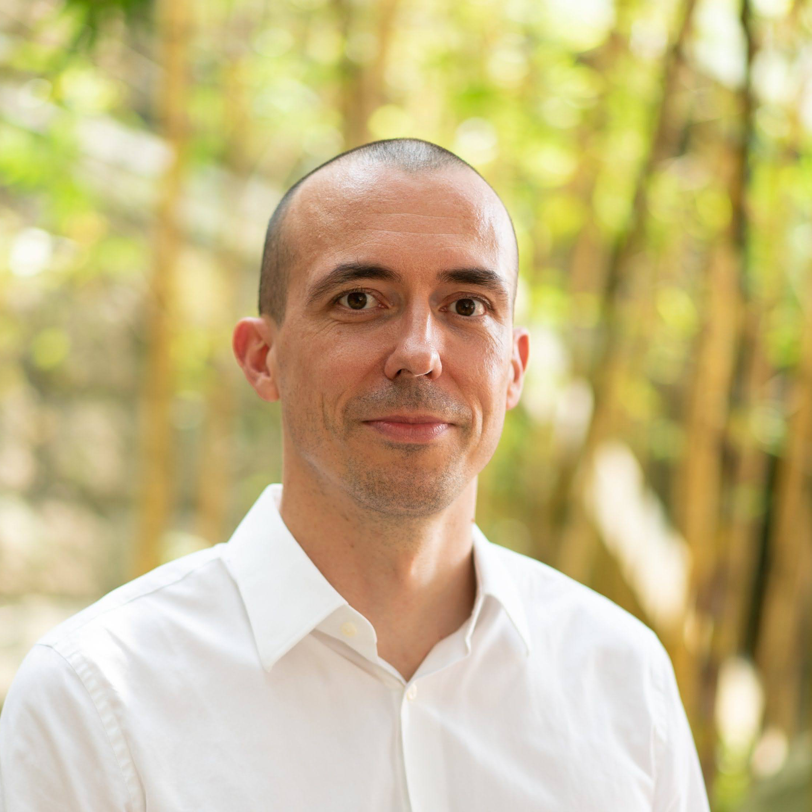
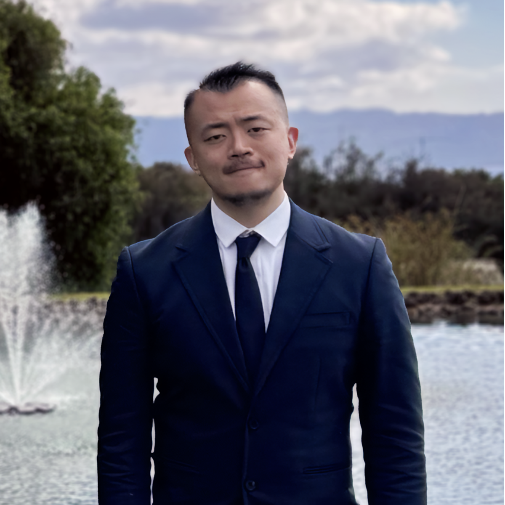
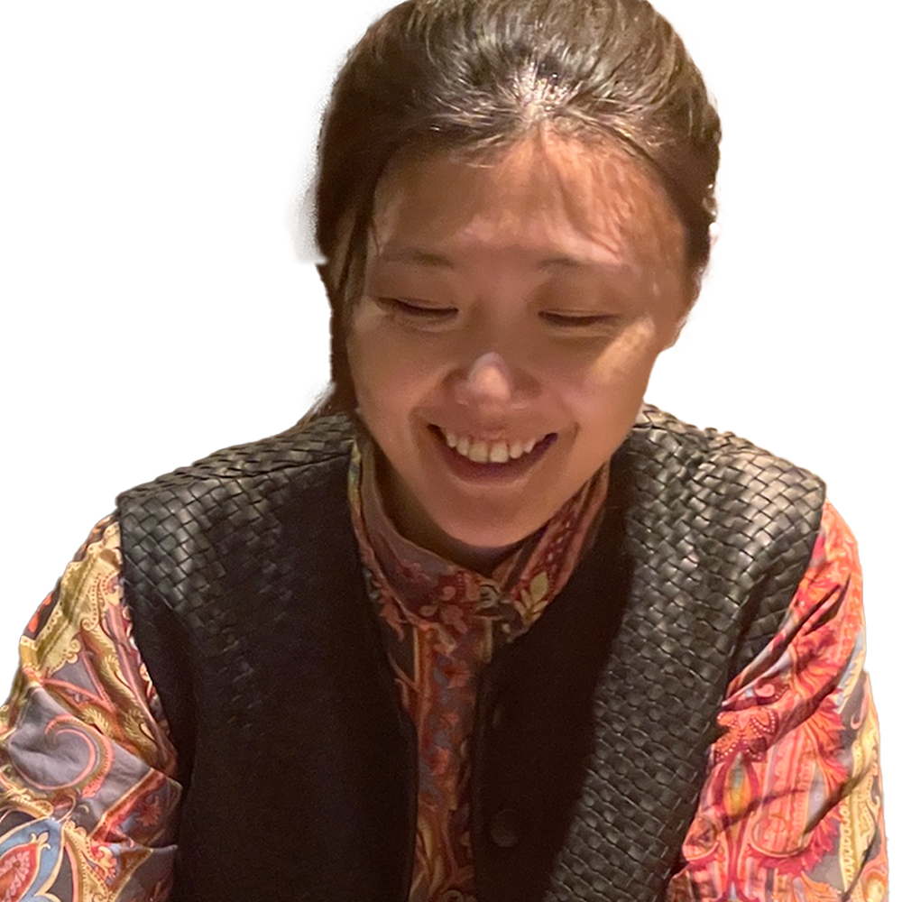
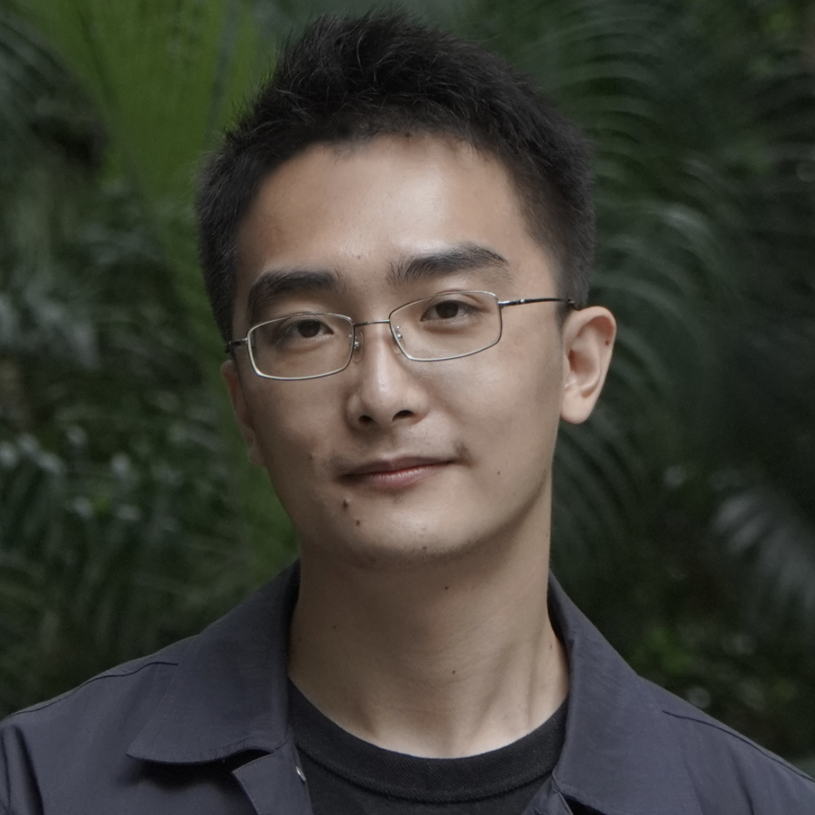
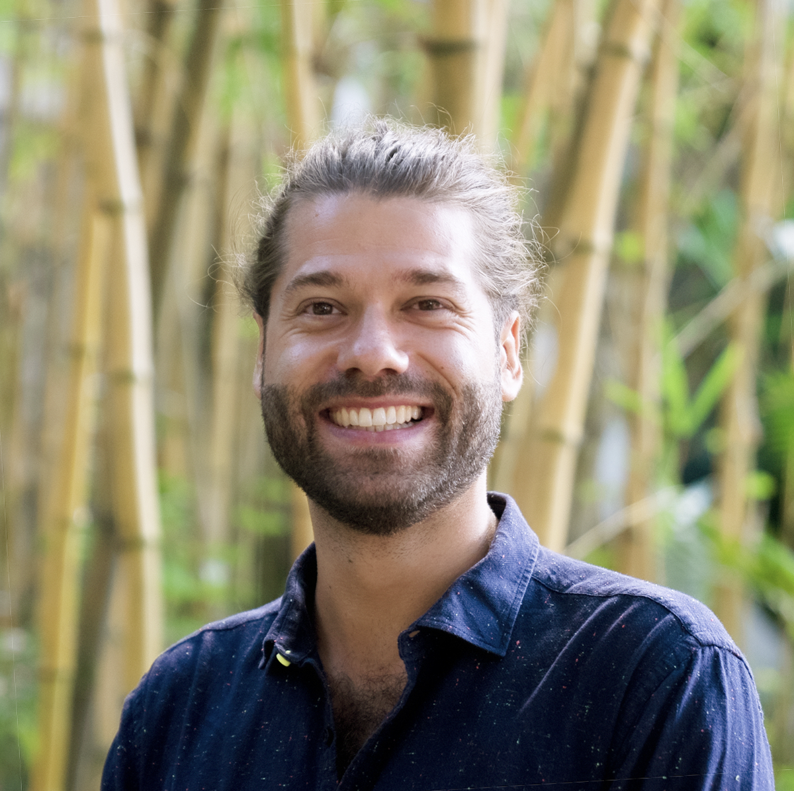
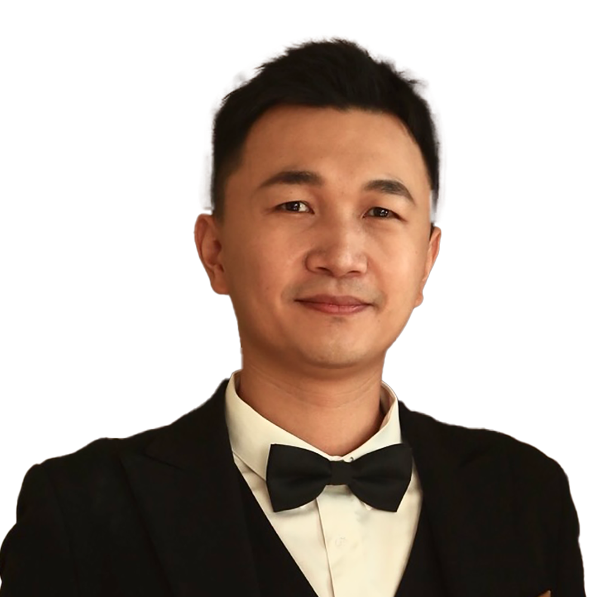
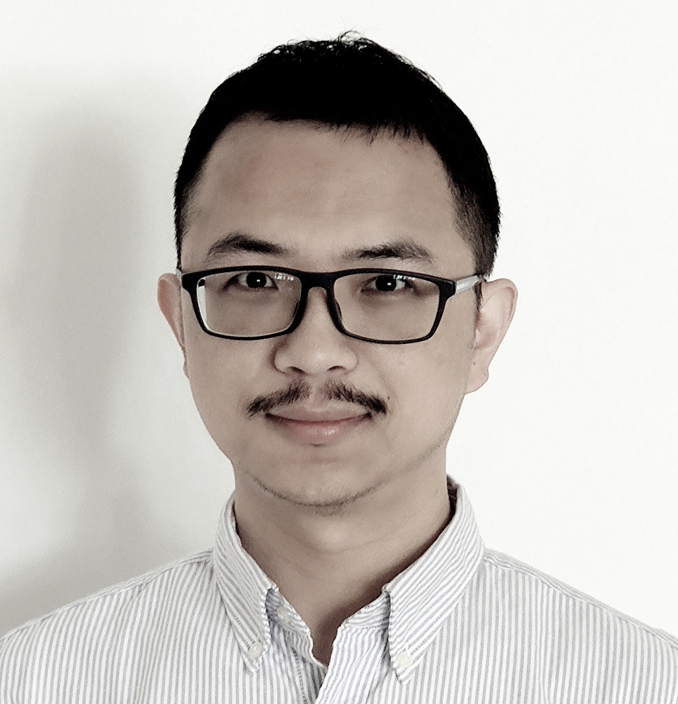
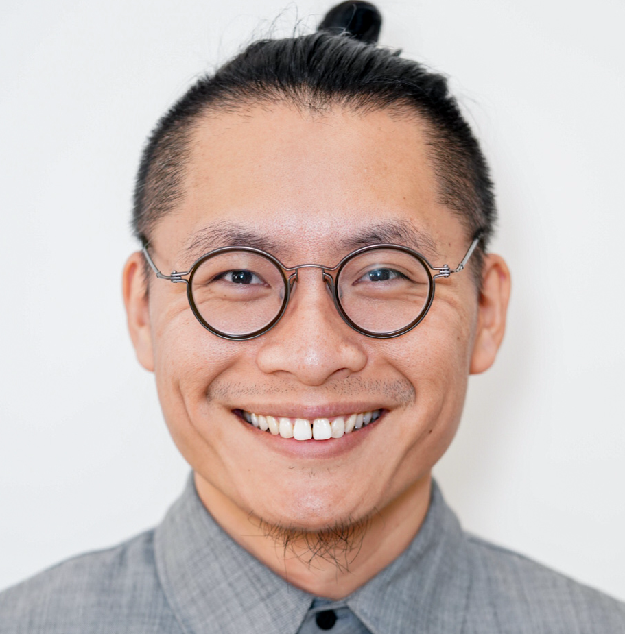
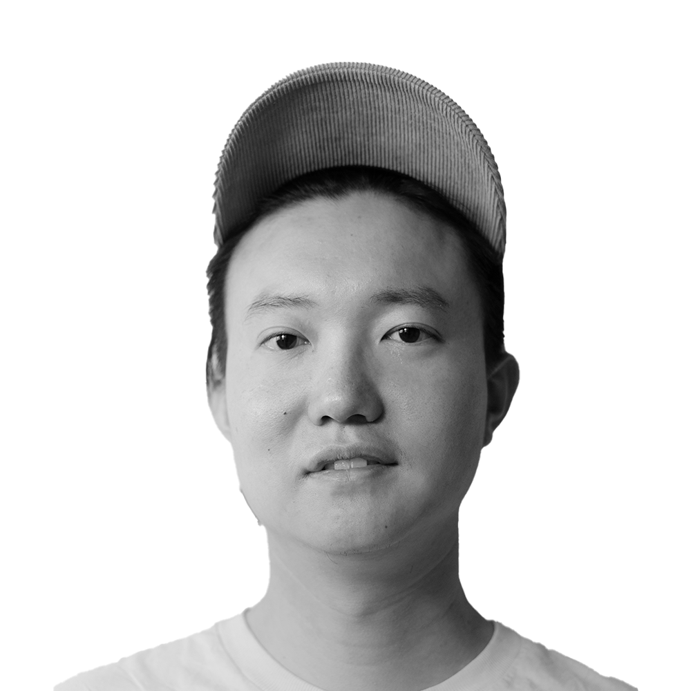
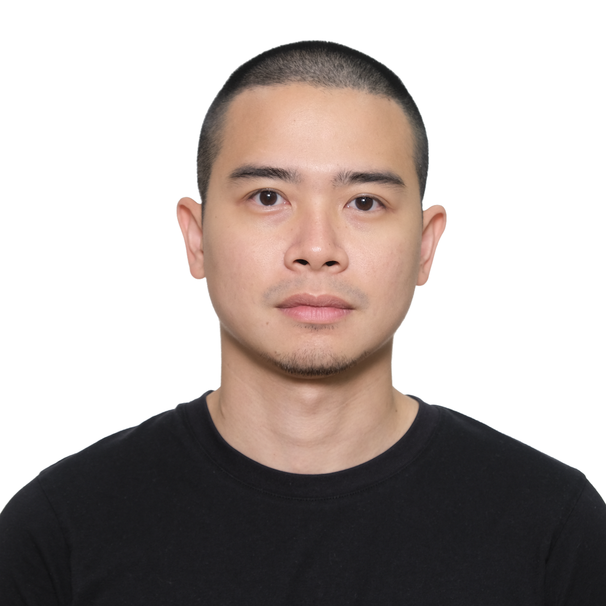

```{=html}
<style>
.table-container {
    display: flex;
    flex-direction: row;
    align-items: center;
    margin-bottom: 20px;
    padding: 25px;
    border: 0.25px dotted #aaa;
    border-radius: 10px;
    flex-wrap: wrap;
}

.image-cell {
    flex: 0 0 200px;
    text-align: center;
    padding-right: 30px;
}

.image-cell img {
    max-width: 100%;
    height: auto;
    object-fit: cover;
    border-radius: 10px;
}

.text-cell {
    flex: 1;
    min-width: 280px;
}

.text-cell h3 {
    margin: 0;
    font-size: 1.2em;
    font-weight: bold;
}

.text-cell p {
    margin: 5px 0;
    font-size: 1.1em;
    line-height: 1.5;
}

/* MEDIA QUERY for mobile or narrow screens */
@media (max-width: 768px) {
    .table-container {
        flex-direction: column;
        padding: 15px;
    }

    .image-cell {
        padding-right: 0;
        margin-bottom: 15px;
    }

    .text-cell {
        min-width: 100%;
    }
}
</style>

```

```{=html}
<div class="table-container">
    <div class="image-cell">
        
    </div>
    <div class="text-cell">
        <h3>Chair: Prof. Dr. Kristof CROLLA</h3>
        <p>Prof. Dr. Kristof CROLLA is a licensed architect and tenured Associate Professor at the University of Hong Kong (HKU), where he is Associate Dean (Special Projects) at the Faculty of Architecture, teaches in the Master of Architecture program and directs both the Bachelor of Arts & Science Design+ program and the Building Simplexity Lab (BSL) research group. He also runs his architectural practice, Laboratory for Explorative Architecture & Design Ltd. (LEAD). Crolla has worked with renowned firms like Zaha Hadid Architects and has been invited to participate as a critic, lecturer, and tutor worldwide. He is best known for projects like 'YEZO', 'Golden Moon', and 'ZCB Bamboo Pavilion', which earned him numerous awards, including the World Architecture Festival Small Project of the Year 2016. Crolla completed his PhD at RMIT, Melbourne, and in 2019, was appointed as a Task Force Expert Member for Bamboo Construction by INBAR. He was the Organisation Committee Chair of the CAADRIA 2021 Hong Kong Conference (see website: <a href="https://caadria2021.org/" target="_blank">caadria2021.org</a>).</p>
    </div>
</div>
```

```{=html}
<div class="table-container">
    <div class="image-cell">
        
    </div>
    <div class="text-cell">
        <h3>Co-Chair: Prof. Dr. Kam-Ming Mark TAM </h3>
        <p>Prof. Dr. Kam-Ming Mark TAM is an Assistant Professor of Architectural Structures at the University of Hong Kong, specialising in computational design, structural geometry, and digital manufacturing techniques. He has expertise in Geometric Deep Learning (GDL) and Deep Reinforcement Learning, which he developed during his doctoral research at ETH Zürich. Tam’s doctoral thesis focused on novel GDL methodologies for learning and modelling hierarchical discrete data structures like meshes. Before his doctoral studies, Tam earned a Master of Engineering (MEng) from MIT and a Master of Architecture from the University of Waterloo. His MEng research, which proposed a method for robotics-enabled 3-D printing based on principal stress line, received the Tsuboi best paper award for the 2015th International Association for Shell and Spatial Structures. He has taught at various institutions, including Singapore University of Technology and Design and Pratt Institute. His work has been presented at numerous conferences, and he has contributed to the development of additive manufacturing techniques and the realisation of large-scale architectural projects such as OneC1TY in Nashville.</p>
    </div>
</div>
```

```{=html}
<div class="table-container">
    <div class="image-cell">
        
    </div>
    <div class="text-cell">
        <h3>Co-Chair: Prof. Dr. Hongshan Guo</h3>
        <p>Dr. Hongshan Guo offers a unique blend of architectural aesthetics and robust engineering. Trained at Harbin Institute of Technology, and later at Columbia and Princeton Universities, she embodies the fusion of architectural finesse with engineering precision. Her expertise extends to predictive technologies, rooted in her background merging built environments with advanced computational models. Dr. Guo’s research focuses on radiant environments, thermal comfort, and enhancing human experiences within architectural spaces through advanced techniques. She explores the influence of radiant environments on perceived thermal comfort and advocates for integrating architectural designs with sustainable energy mechanisms such as photovoltaics and geothermal solutions. Beyond academia, her achievements include a patented technique in predictive analytics and a strategic role in a leading Fortune 500 financial company, leveraging Large Language Models for innovative applications. As she begins her journey at Hong Kong University, Dr. Guo promises to integrate traditional architectural principles with modern engineering solutions, offering transformative contributions to the institution’s architectural community.</p>
    </div>
</div>
```

```{=html}
<div class="table-container">
    <div class="image-cell">
        
    </div>
    <div class="text-cell">
        <h3>Co-Chair: Mr. Haotian ZHANG</h3>
        <p>Mr. Haotian Zhang is an architectural designer, media artist, and Lecturer at the University of Hong Kong, where he teaches studios and digital representation. He holds degrees from Cooper Union and Tsinghua University. Zhang’s work focuses on realist digital media, investigating their representational potential and politics in various mediums. He co-founded multi-disciplinary design studio FrankanLisa with Tianying Li. Their work has been exhibited internationally at prestigious venues including the Carnegie Museum of Art and the Bi-City Biennale of Urbanism/Architecture. Zhang and Li’s recent exhibition at HKU explored point cloud operation and aesthetics, a project supported by the Design Trust Seed Grant. Zhang has been an invited speaker at various events and contributed to the translation of Herman Hertzberger’s 'Space and Learning' for the Chinese edition.</p>
    </div>
</div>
```

```{=html}
<div class="table-container">
    <div class="image-cell">
        
    </div>
    <div class="text-cell">
        <h3>Co-Chair: DR. GARVIN GOEPEL</h3>
        <p>Dr. Garvin Goepel is a designer and researcher specializing in integrating Augmented Reality (AR) with generative architecture. Currently a Post-doctoral Fellow and Lecturer at the University of Hong Kong (HKU), he completed his PhD at the Chinese University of Hong Kong (CUHK) as a Hong Kong PhD Fellowship Scheme awardee. Goepel’s research focuses on collaborative holographic-driven construction, technology-infused craftsmanship, and replacing conventional paper drawing-based communication with holographic instructions. He believes AR can democratize skill through simple, intuitive instructions without professional training. Goepel holds a Master of Architecture with distinction from the University of Applied Arts, Vienna, and has worked with practices such as Coop Himmelb(l)au. He has researched at ETH’s Block Research Group, CUHK, and HKU, published in leading conferences and journals, and taught AR and design workshops internationally. His work includes the mixed-reality artwork 'Resonance-In-Sight' for the Hong Kong Museum of Arts. In 2021, he was part of the organizing committee for the 26th International Conference of CAADRIA.</p>
    </div>
</div>
```

```{=html}
<div class="table-container">
    <div class="image-cell">
        
    </div>
    <div class="text-cell">
        <h3>Committee: Prof. Dr. Tan Tan</h3>
        <p>Prof Tan Tan is an Assistant Professor at the Department of Real Estate and Construction, Faculty of Architecture, the University of Hong Kong. Previously, he held a postdoctoral position at the TU Delft in the Netherlands and NCCR Digital Fabrication in Switzerland. He earned his PhD and MSc degrees from UCL Bartlett and his BArch from Huazhong University of Science and Technology. His primary fields of research interest include two streams: design engineering informatics and design management innovation. His research draws into the intersection of architecture, technology, and business to bridge the connection between architectural design and construction management, especially in exploring frontier knowledge and advanced solutions to Design for X (DfX) for industrialized construction. </p>
    </div>
</div>
```

```{=html}
<div class="table-container">
    <div class="image-cell">
        
    </div>
    <div class="text-cell">
        <h3>Committee: Prof. Dr. Fan (Frank) Xue</h3>
        <p>Prof. Dr. Fan (Frank) Xue is an Associate Professor in the Department of Real Estate and Construction at The University of Hong Kong. Frank has an interdisciplinary background in Automation (BEng), Computer Science (MSc), Industrial and Systems Engineering (PhD), and Construction Management (Postdoctoral fellow to present). He is member of ACM, senior member of CGS, member of ASC, member of HKGISA, member of ISDE, and member of IEEE. He is Deputy Director of HKUrbanLabs—iLab, Vice Director of National Center of Technology Innovation for Digital Construction—Hong Kong Branch, Vice Director of Hong Kong-Zhuhai-Macao Station of the ‘Spatial Information Technologies’ Key Scientific Research Base of National Cultural Heritage Administration of China. He also serves as Member of Hong Kong RGC-APSF (Engineering Panel), Vice-Chair of ACM-Hong Kong, committee of CGS-BIM, committee of ASC-Smart Construction, and committee of ISDE-Digital Heritage. His research interests include building and city information modeling, LiDAR data processing, derivative-free optimization, blockchain, and machine learning.</p>
    </div>
</div>
```

```{=html}
<div class="table-container">
    <div class="image-cell">
        
    </div>
    <div class="text-cell">
        <h3>Committee: Mr. Mono Tung</h3>
        <p>Mono Tung is an architectural designer, columnist, and assistant lecturer at the University of Hong Kong, specializing in computational design, digital and robotic fabrication. He has worked with leading firms like Zaha Hadid Architects and Foster and Partners. His master's thesis on interactive pneumatic structures showcased innovative materiality and human interaction. This project has been showcased at multiple venues and featured on Michael Webb’s website. As a regular newspaper columnist, he writes on AI-assisted design, VR in architecture, and latest technologies applied to architecture. Mono’s collaborations with artists have contributed spatial designs to major art festivals, including the Echigo Tsumari Art Triennale, Singapore Art Week, and the Landskrona Foto Festival in Sweden. His multidisciplinary approach bridges architecture, technology, and art, redefining their collective impact.</p>
    </div>
</div>
```

```{=html}
<div class="table-container">
    <div class="image-cell">
        
    </div>
    <div class="text-cell">
        <h3>Committee: Mr. Kaiho Yu</h3>
        <p>Kaiho Yu is a researcher, designer, and lecturer at the University of Hong Kong. His research emphasizes a transdisciplinary approach, merging digital media, computer simulation, gaming, and robotics with the disciplines to envision a future where architecture can be conceived as intelligent and adaptable systems. He serves in advisory and committee roles for various journals and conferences, including the Bartlett’s ‘Prospectives’ Journal, DigitalFUTURES, and the International Conference on Computational Design and Robotic Fabrication (CDRF).</p>
    </div>
</div>
```

```{=html}
<div class="table-container">
    <div class="image-cell">
        
    </div>
    <div class="text-cell">
        <h3>Committee: Mr. Jeff WIDJAJA</h3>
        <p>Jeff Widjaja is an architectural designer, digital fabricator, and Assistant Lecturer at the University of Hong Kong. He teaches design studio, digital representation, and provides support in fabrication technologies. His expertise lies in robotic additive manufacturing, specifically exploring non-planar toolpaths and variable material extrusion rates. Jeff has worked with several international architectural firms across Asia and North America and holds degrees from the Architectural Association and the Illinois Institute of Technology.</p>
    </div>
</div>
```

# General Committee for CAADFutures

### The Foundation
CAAD Futures was set up under Dutch law in 1985 with three founding members; Tom Maver, Rik Schijf, and Harry Wagter with the purpose of promoting, through international conferences and publications, the advancement of Computer Aided Architectural Design in the service of those concerned with the quality of the built environment with initial capital provided by the Housing Ministry of the Netherlands Government. 

Many decades later, no longer based in the Netherlands, the Foundation continues to play a major global role in advancing the field and documenting progress in research with its biennial conference.  We work in collaboration with the several regionally focused groups that have been established over these years to support and cultivate a richly diverse research community. 

The mission of the CAAD Futures foundation continues to be:

to promote research interactions and collaborations between researchers, including PhD students and their supervisors;

to provide a platform for communication among researchers in the field of CAAD;

to play an active role in the dissemination of such progress to the scientific architectural community and the architectural practice.

### Next Conference
The CAAD Futures 2025 conference will take place in Asia, at the University of Hong Kong. 

The CAAD Futures 2027 conference will take place in the Americas. If you are interested in hosting the conference in 2027 at your institution, please email any board member by the end of the year 2024.

The CAAD Futures 2029 conference will take place in Europe.

### Board members
The current board members of the CAAD Futures Foundation are:

- Mine Özkar, Chair. Professor of Architecture at Istanbul Technical University, Türkiye.
- Christiane M. Herr, Vice-Chair. Professor, SUSTech School of Design.
- Daniel Cardoso Llach, Vice-Chair. Associate Professor, School of Architecture, Carnegie Mellon University, United States.  

Find out more about the CAAD Futures Foundation [here](https://sites.google.com/unicamp.br/caadfutures/).
