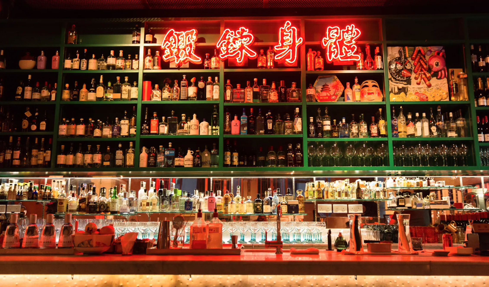

```{=html}
<!DOCTYPE html>
<html lang="en">
<head>
  <meta charset="UTF-8" />
  <meta name="viewport" content="width=device-width, initial-scale=1" />
  <title>Schedule Toggle & Super-Light Gray Calendar</title>
  <style>
    /*————————————————————————————————————————————————————————————————
      1) GLOBAL RESET & BASE STYLES
    —————————————————————————————————————————————————————————————————*/
    * {
      box-sizing: border-box;
      margin: 0;
      padding: 0;
    }
    body {
      font-family: Arial, sans-serif;
      background: #fafafa;
      color: #222;
      padding: 20px;
    }
    h1 {
      font-size: 20px;
      margin-bottom: 12px;
    }

    /*————————————————————————————————————————————————————————————————
      2) VIEW TOGGLE BUTTONS
    —————————————————————————————————————————————————————————————————*/
    .view-toggle {
      margin-bottom: 16px;
    }
    .view-toggle button {
      padding: 6px 12px;
      margin-right: 8px;
      font-size: 14px;
      border: 1px solid #888;
      background: #fff;
      color: #333;
      border-radius: 3px;
      cursor: pointer;
    }
    .view-toggle button.active {
      background: #333;
      color: #fff;
      border-color: #333;
    }

    /*————————————————————————————————————————————————————————————————
      3) TWO VIEW CONTAINERS
    —————————————————————————————————————————————————————————————————*/
    #calendar‐view,
    #qmd‐view {
      display: none;
    }
    #calendar‐view.active,
    #qmd‐view.active {
      display: block;
    }

    /*————————————————————————————————————————————————————————————————
      4) SHARED GRID STYLES (Calendar)
    —————————————————————————————————————————————————————————————————*/
    .schedule-all {
      display: flex;
      flex-direction: column;
      gap: 0;               /* Panels flush with each other */
      border: 1px solid #ccc;
      background: #fff;
      overflow: visible;    /* Tooltips can overflow */
    }
    .schedule-grid {
      display: grid;
      grid-auto-rows: 30px; /* 30px per half-hour slot */
      overflow: visible;    /* Let tooltips spill out */
    }
    .time-label {
      font-size: 12px;
      color: #555;
      text-align: right;
      padding-right: 6px;
      border-bottom: 1px solid #eee;
      border-right: 1px solid #eee;
      background: #f5f5f5;
    }
    .day-header {
      background: #000;
      color: #fff;
      text-align: center;
      font-size: 13px;
      font-weight: bold;
      border-right: 1px solid #444;
      border-bottom: 1px solid #444;
      padding-top: 4px;
    }

    /*————————————————————————————————————————————————————————————————
      5) EVENT BLOCK & TOOLTIP
    —————————————————————————————————————————————————————————————————*/
    .event {
      position: relative;
      border-radius: 3px;
      font-size: 12px;
      padding: 4px;
      cursor: pointer;
      overflow: visible;
      z-index: 1; /* default stacking level */
      transition: box-shadow 0.15s ease, z-index 0.15s ease;
    }
    .event:hover {
      z-index: 100; /* bring hovered event above all siblings */
      box-shadow: 0 5px 15px rgba(0, 0, 0, 0.2);
    }
    .no-lift:hover {
      /* Remove the “lift” shadow */
      box-shadow: none !important;
      /* Keep it at its normal z-index (so it doesn’t jump above siblings) */
      z-index: 1 !important;
    }
    .event-title {
      font-weight: bold;
      white-space: nowrap;
      overflow: hidden;
      text-overflow: ellipsis;
    }
    .tooltip {
      position: absolute;
      bottom: 100%;
      left: 0;
      margin-bottom: 6px;
      /* keep the same width, padding, background, etc. */
      width: 340px;
      padding: 8px;
      background: #fafafa;
      border: 1px solid #888;
      border-radius: 4px;
      font-size: 12px;
      line-height: 1.3;
      color: #222;
      box-shadow: 0 4px 10px rgba(0, 0, 0, 0.15);
      opacity: 0;
      visibility: hidden;
      transition: opacity 0.2s ease, visibility 0.2s ease;
      z-index: 999; /* stays on top */
    }
    .event:hover .tooltip {
      opacity: 1;
      visibility: visible;
    }


    /*————————————————————————————————————————————————————————————————
      6) SUPER-LIGHT GRAY PALETTE
      (All events are very light; “Shenzhen” lightest; Gala/Drinks slightly darker)
    —————————————————————————————————————————————————————————————————*/
    /* Discovering Shenzhen → very light (#f9f9f9) */
    .cat-fieldtrip {
      background: #f9f9f9;
      color: #000;
      border: 1px solid #e6e6e6;
    }
    /* Welcoming Drinks & Local AI Social → slightly darker (#e6e6e6) */
    .cat-eveningsocial {
      background: #e6e6e6;
      color: #000;
      border: 1px solid #cccccc;
    }
    /* Gala Dinner & Junk Boat → a bit darker (#dcdcdc) */
    .cat-social {
      background: #dcdcdc;
      color: #000;
      border: 1px solid #bfbfbf;
    }
    /* Tram Tour → mid-light gray (#d4d4d4) */
    .cat-eveningtour {
      background: #d4d4d4;
      color: #000;
      border: 1px solid #bbbbbb;
    }
    /* Architecture tours (Victoria Peak, Henderson, etc.) → slightly darker (#c8c8c8) */
    .cat-architecture {
      background: #c8c8c8;
      color: #000;
      border: 1px solid #aaaaaa;
    }
    .event-link {
    text-decoration: none;
    color: inherit;
    display: block;     /* Allow it to contain the .event div */
      }
      .event-link:hover {
        /* (Optional) keep the hover shadow on .event itself via its own CSS,
           without adding any extra underline or color change from the <a> */
      }

    /*————————————————————————————————————————————————————————————————
      7) QMD VIEW STYLING
    —————————————————————————————————————————————————————————————————*/
    #qmd‐view pre {
      background: #f7f7f7;
      border: 1px solid #ddd;
      padding: 12px;
      border-radius: 4px;
      overflow: auto;
      max-height: 70vh;
      white-space: pre-wrap;
      font-family: Consolas, "Courier New", monospace;
      font-size: 13px;
      line-height: 1.4;
    }
  </style>
</head>
<body>

  <h1>Side Events Calendar</h1>

  <!--————————————————————————————————————————————————————————————————
    VIEW TOGGLE BUTTONS
  —————————————————————————————————————————————————————————————————-->
<div style="margin-bottom: 20px;">
  <a href="demo.qmd"
     style="
       display: inline-block; padding: 8px 16px; background: #333;
       color: #fff; text-decoration: none; border-radius: 4px;
       font-size: 14px; opacity: 0.5; cursor: not-allowed;
     ">
    ← View Calendar
  </a>
  <a href="events_lineup.qmd"
     style="
       display: inline-block; padding: 8px 16px; background: #333;
       color: #fff; text-decoration: none; border-radius: 4px;
       font-size: 14px;
     ">
    View Lineup →
  </a>
</div>

  <!--————————————————————————————————————————————————————————————————
    8) CALENDAR VIEW (Default)
  —————————————————————————————————————————————————————————————————-->
  <div id="calendar‐view" class="active">

    <!--————————————————————————————————————————————————————
      PANEL 1: EVENING EVENTS (Tue 1/7 → Fri 4/7; 18:00 → 22:00)
    —————————————————————————————————————————————————————-->
    <div class="schedule-all">
      <div class="schedule-grid"
           style="
             grid-template-columns: 80px repeat(4, 1fr);
             grid-template-rows: auto repeat(8, 30px);
           ">
        <!-- Row 1 (Day Headers) -->
        <div class="day-header" style="grid-row: 1; grid-column: 2;">Tue 1/7</div>
        <div class="day-header" style="grid-row: 1; grid-column: 3;">Wed 2/7</div>
        <div class="day-header" style="grid-row: 1; grid-column: 4;">Thu 3/7</div>
        <div class="day-header" style="grid-row: 1; grid-column: 5;">Fri 4/7</div>

        <!-- Rows 2–9 (Time Labels 18:00 → 21:30) -->
        <div class="time-label" style="grid-row: 2; grid-column: 1;">18:00</div>
        <div class="time-label" style="grid-row: 3; grid-column: 1;">18:30</div>
        <div class="time-label" style="grid-row: 4; grid-column: 1;">19:00</div>
        <div class="time-label" style="grid-row: 5; grid-column: 1;">19:30</div>
        <div class="time-label" style="grid-row: 6; grid-column: 1;">20:00</div>
        <div class="time-label" style="grid-row: 7; grid-column: 1;">20:30</div>
        <div class="time-label" style="grid-row: 8; grid-column: 1;">21:00</div>
        <div class="time-label" style="grid-row: 9; grid-column: 1;">21:30</div>

        <!-- “Welcoming Drinks” (Tue 1/7, 18:00 – 21:00) ▸ cat-eveningsocial -->
        <div class="event cat-eveningsocial"
             style="
               grid-row: 2 / 8;      /* 18:00 → 21:00 */
               grid-column: 2;       /* column Tue 1/7 */
             ">
          <div class="event-title">Welcoming Drinks</div>
          <div class="tooltip">
          <a href="event_details.html#BarCentral">
            </a>
            <strong>Welcoming Drinks</strong><br/>
            <em>Kick-off Reception at Bar in Central</em><br/>
            Date: July 1 | 18:00 – 21:00<br/>
            Cost: Complimentary
          </div>
        </div>

        <!-- “Victoria Peak at Night” (Wed 2/7, 19:00 – 21:00) ▸ cat-architecture -->
        <div class="event cat-architecture"
             style="
               grid-row: 4 / 8;      /* 19:00 → 21:00 */
               grid-column: 3;       /* column Wed 2/7 */
             ">
          <div class="event-title">Victoria Peak at Night</div>
          <div class="tooltip">
          <a href="event_details.html#VictoriaPeak">
            </a>
            <strong>Victoria Peak at Night</strong><br/>
            <em>A panoramic evening escape above the city.</em><br/>
            Date: July 2 | 19:00 – 21:00<br/>
            <!-- Cost: HKD 250 -->
          </div>
        </div>

        <!-- “Henderson by Zaha Hadid Arch.” (Wed 2/7, 20:30 – 22:00) ▸ cat-architecture -->
        
        <div class="event cat-architecture"
             style="
               grid-row: 7 / 10;     /* 20:30 → 22:00 */
               grid-column: 3;       /* column Wed 2/7 */
             ">

          <div class="event-title">Henderson by Zaha Hadid Arch.</div>
          <div class="tooltip">

            <a href="event_details.html#Henderson"></a>
                 
            <strong>Henderson by Zaha Hadid Arch.</strong><br/>
            <em>Vertical Fluidity & Urban Innovation</em><br/>
            Date: July 2 | 20:30 – 22:00<br/>
            Cost: HKD 250
          </div>
        </div>
        

        <!-- “Victoria Peak at Night” (Thu 3/7, 19:00 – 21:00) ▸ cat-architecture -->
        <div class="event cat-architecture"
             style="
               grid-row: 4 / 8;      /* 19:00 → 21:00 */
               grid-column: 4;       /* column Thu 3/7 */
             ">
          <div class="event-title">Victoria Peak at Night</div>
          <div class="tooltip">
          <a href="event_details.html#VictoriaPeak">
            </a>
            <strong>Victoria Peak at Night</strong><br/>
            <em>A panoramic evening escape above the city.</em><br/>
            Date: July 3 | 19:00 – 21:00<br/>
            <!-- Cost: HKD 250 -->
          </div>
        </div>

        <!-- “Local AI Social” (Thu 3/7, 19:00 – 21:00) ▸ cat-eveningsocial -->
        <div class="event cat-eveningsocial"
             style="
               grid-row: 5 / 8;      /* 19:00 → 21:00 */
               grid-column: 4;       /* column Thu 3/7  (same column as Gala would have been on Fri) */
             ">
          <div class="event-title">AI Social</div>
          <div class="tooltip">
          <a href="event_details.html#BarCentral">
            </a>
            <strong>Local AI Social</strong><br/>
            <em>Networking at Bar in Sai Ying Pun</em><br/>
            Date: July 3 | 19:00 – 21:00<br/>
            Cost: HKD TBU
          </div>
        </div>

        <!-- “Gala Dinner (+1 ticket)” (Fri 4/7, 19:30 – 21:00) ▸ cat-social -->
        <div class="event cat-social"
             style="
               grid-row: 5 / 8;      /* 19:30 → 21:00 */
               grid-column: 5;       /* column Fri 4/7 */
             ">
          <div class="event-title">Gala Dinner (+1 ticket)</div>
          <div class="tooltip">
          <a href="event_details.html#GalaDinner">
            </a>
            <strong>Gala Dinner (+1 ticket)</strong><br/>
            <em>Banquet – Maxim’s Palace</em><br/>
            Date: July 4 | 19:30 – 21:00<br/>
            (No extra cost for registered guest)
          </div>
        </div>

      </div>
      <!-- end Panel 1 -->


      <!--————————————————————————————————————————————————————
        PANEL 2: FULL-DAY EVENTS (Wed 5/7 & Sat 6/7; 08:00 → 21:30)
        — Only a single header row for “Wed 5/7” + “Sat 6/7”
      —————————————————————————————————————————————————————-->
      <div class="schedule-grid"
           style="
             /* 80px time-column | 4 sub-cols for Wed 5/7 | 1 col for Sat 6/7 */
             grid-template-columns: 80px repeat(4, 1fr) 1fr;
             /* Only one header row: auto, then 27 half-hour slots (08:00 → 21:30) */
             grid-template-rows: auto repeat(27, 30px);
           ">
        <!-- Row 1: Main Headers -->
        <div class="day-header" style="grid-row: 1; grid-column: 2 / span 4;">
          Sat 5/7
        </div>
        <div class="day-header" style="grid-row: 1; grid-column: 6;">
          Sun 6/7
        </div>

        <!-- Row 2–28: Time Labels 08:00 → 21:30 -->
        <div class="time-label" style="grid-row: 2;  grid-column: 1;">08:00</div>
        <div class="time-label" style="grid-row: 3;  grid-column: 1;">08:30</div>
        <div class="time-label" style="grid-row: 4;  grid-column: 1;">09:00</div>
        <div class="time-label" style="grid-row: 5;  grid-column: 1;">09:30</div>
        <div class="time-label" style="grid-row: 6;  grid-column: 1;">10:00</div>
        <div class="time-label" style="grid-row: 7;  grid-column: 1;">10:30</div>
        <div class="time-label" style="grid-row: 8;  grid-column: 1;">11:00</div>
        <div class="time-label" style="grid-row: 9;  grid-column: 1;">11:30</div>
        <div class="time-label" style="grid-row: 10; grid-column: 1;">12:00</div>
        <div class="time-label" style="grid-row: 11; grid-column: 1;">12:30</div>
        <div class="time-label" style="grid-row: 12; grid-column: 1;">13:00</div>
        <div class="time-label" style="grid-row: 13; grid-column: 1;">13:30</div>
        <div class="time-label" style="grid-row: 14; grid-column: 1;">14:00</div>
        <div class="time-label" style="grid-row: 15; grid-column: 1;">14:30</div>
        <div class="time-label" style="grid-row: 16; grid-column: 1;">15:00</div>
        <div class="time-label" style="grid-row: 17; grid-column: 1;">15:30</div>
        <div class="time-label" style="grid-row: 18; grid-column: 1;">16:00</div>
        <div class="time-label" style="grid-row: 19; grid-column: 1;">16:30</div>
        <div class="time-label" style="grid-row: 20; grid-column: 1;">17:00</div>
        <div class="time-label" style="grid-row: 21; grid-column: 1;">17:30</div>
        <div class="time-label" style="grid-row: 22; grid-column: 1;">18:00</div>
        <div class="time-label" style="grid-row: 23; grid-column: 1;">18:30</div>
        <div class="time-label" style="grid-row: 24; grid-column: 1;">19:00</div>
        <div class="time-label" style="grid-row: 25; grid-column: 1;">19:30</div>
        <div class="time-label" style="grid-row: 26; grid-column: 1;">20:00</div>
        <div class="time-label" style="grid-row: 27; grid-column: 1;">20:30</div>
        <div class="time-label" style="grid-row: 28; grid-column: 1;">21:00</div>
        <div class="time-label" style="grid-row: 29; grid-column: 1;">21:30</div>

        <!-- “Discovering Shenzhen” (Wed 5/7, 08:30 – 20:30) ▸ cat-fieldtrip -->
        <div class="event cat-fieldtrip no-lift"
             style="
               grid-row: 3 / 27;      /* 08:30 (row 3) → 20:30 (row 27) */
               grid-column: 2 / span 4; /* spans all 4 sub-columns under Wed 5/7 */
             ">
          <div class="event-title">Discovering Shenzhen</div>
          <div class="tooltip">
          <a href="event_details.html#ShenzhenTour">
            </a>
            <strong>Discovering Shenzhen</strong><br/>
            <em>Exploring Innovation & Urban Transformation</em><br/>
            Date: July 5 | 08:30 – 20:30<br/>
            Cost: HKD 900
          </div>
        </div>

        <!-- “Mong Kok & Yau Ma Tei” (Wed 5/7, 09:30 – 11:30) ▸ cat-architecture -->
        <div class="event cat-architecture"
             style="
               grid-row: 5 / 9;      /* 09:30 → 11:30 */
               grid-column: 5;       /* sub-col 4 under Wed 5/7 */
             ?>">
          <div class="event-title">Mong Kok & Yau Ma Tei</div>
          <div class="tooltip">
          <a href="event_details.html#MongkokYauMaTei">
            </a>
            <strong>Mong Kok & Yau Ma Tei</strong><br/>
            <em>Urban Density & Cultural Layers</em><br/>
            Date: July 5 | 09:30 – 11:30<br/>
            Cost: HKD 250
          </div>
        </div>

        <!-- “Henderson by Zaha Hadid Arch.” (Wed 5/7, 13:30 – 15:30) ▸ cat-architecture -->
        <div class="event cat-architecture"
             style="
               grid-row: 13 / 17;     /* 13:30 (row 13) → 15:30 (row 17) */
               grid-column: 2;       /* sub-col 1 under Wed 5/7 */
             ">
          <div class="event-title">Henderson by Zaha Hadid Arch.</div>
          <div class="tooltip">
          <a href="event_details.html#Henderson">
            </a>
            <strong>Henderson by Zaha Hadid Arch.</strong><br/>
            <em>Vertical Fluidity & Urban Innovation</em><br/>
            Date: July 5 | 13:30 – 15:30<br/>
            Cost: HKD 250
          </div>
        </div>

        <!-- “Public Housing Typologies” (Wed 5/7, 13:30 – 15:30) ▸ cat-architecture -->
        <div class="event cat-architecture"
             style="
               grid-row: 13 / 17;     /* 13:30 → 15:30 */
               grid-column: 3;       /* sub-col 2 under Wed 5/7 */
             ">
          <div class="event-title">Public Housing Typologies</div>
          <div class="tooltip">
          <a href="event_details.html#PublicHousing">
            </a>
            <strong>Public Housing Typologies</strong><br/>
            <em>High-Density Residential Design</em><br/>
            Date: July 5 | 13:30 – 15:30<br/>
            Cost: HKD 250
          </div>
        </div>

        <!-- “M+ Art Museum” (Wed 5/7, 14:30 – 16:30) ▸ cat-architecture -->
        <div class="event cat-architecture"
             style="
               grid-row: 15 / 19;     /* 14:30 (row 15) → 16:30 (row 19) */
               grid-column: 5;       /* sub-col 4 under Wed 5/7 */
             ?>">
          <div class="event-title">M+ Art Museum</div>
          <div class="tooltip">
          <a href="event_details.html#MPlus">
            </a>
            <strong>M+ Art Museum by Herzog & de Meuron</strong><br/>
            <em>Inside the Making of a Cultural Landmark</em><br/>
            Date: July 5 | 14:30 – 16:30<br/>
            Cost: HKD 250
          </div>
        </div>

        <!-- “Henderson by Zaha Hadid Arch.” (Wed 5/7, 16:30 – 18:30) ▸ cat-architecture -->
        <div class="event cat-architecture"
             style="
               grid-row: 19 / 23;     /* 16:30 (row 19) → 18:30 (row 23) */
               grid-column: 2;       /* sub-col 1 under Wed 5/7 */
             ?>">
          <div class="event-title">Henderson by Zaha Hadid Arch.</div>
          <div class="tooltip">
          <a href="event_details.html#Henderson">
            </a>
            <strong>Henderson by Zaha Hadid Arch.</strong><br/>
            <em>Vertical Fluidity & Urban Innovation</em><br/>
            Date: July 5 | 16:30 – 18:30<br/>
            Cost: HKD 250
          </div>
        </div>

        <!-- “Wan Chai Temple & Blue House” (Wed 5/7, 16:30 – 18:30) ▸ cat-architecture -->
        <div class="event cat-architecture"
             style="
               grid-row: 15 / 19;     /* 14:30 → 16:30 */
               grid-column: 4;       /* sub-col 4 under Wed 5/7 */
             ?>">
          <div class="event-title">Wan Chai Temple & Blue House</div>
          <div class="tooltip">
          <a href="event_details.html#WanChaiTempleBlueHouse">
            </a>
            <strong>Wan Chai Temple & Blue House</strong><br/>
            <em>Heritage & Urban Regeneration</em><br/>
            Date: July 5 | 14:30 – 16:30<br/>
            Cost: HKD 250
          </div>
        </div>

        <!-- “Tram Tour (East → West)” (Wed 5/7, 19:30 – 20:30) ▸ cat-eveningtour -->
        <div class="event cat-eveningtour"
             style="
               grid-row: 26 / 28;     /* 19:30 → 20:30 */
               grid-column: 2 / span 4; /* spans all four sub-cols under Wed 5/7 */
             ">
          <div class="event-title">Tram Tour (East → West)</div>
          <div class="tooltip">
          <a href="event_details.html#TramTourWestToEast">
            </a>
            <strong>Tram Tour</strong><br/>
            <em>A moving portrait of Hong Kong’s architecture.</em><br/>
            Date: July 5 |19:30 – 20:30<br/>
            Cost: HKD 150
          </div>
        </div>

        <!-- “Tram Tour (West → East)” (Wed 5/7, 20:30 – 21:30) ▸ cat-eveningtour -->
        <div class="event cat-eveningtour"
             style="
               grid-row: 28 / 30;     /* 20:30 → 21:30 */
               grid-column: 2 / span 4; /* spans all four sub-cols under Wed 5/7 */
             ">
          <div class="event-title">Tram Tour (West → East)</div>
          <div class="tooltip">
          <a href="event_details.html#TramTourWestToEast">
            </a>
            <strong>Tram Tour</strong><br/>
            <em>A moving portrait of Hong Kong’s architecture.</em><br/>
            Date: July 5 | 20:30 – 21:30<br/>
            Cost: HKD 150
          </div>
        </div>

        <!-- “Junk Boat in Sai Kung” (Sat 6/7, 08:30 – 19:30) ▸ cat-social -->
        <div class="event cat-social"
             style="
               grid-row: 3 / 25;      /* 08:30 (row 3) → 19:30 (row 25) */
               grid-column: 6;       /* column Sat 6/7 */
             ">
          <div class="event-title">Junk Boat in Sai Kung</div>
          <div class="tooltip">
          <a href="event_details.html#JunkBoatSaiKung">
            </a>
            <strong>Junk Boat in Sai Kung</strong><br/>
            <em>A scenic escape to Hong Kong’s back-garden.</em><br/>
            Date: July 6 | 08:30 – 19:30<br/>
            Cost: HKD 960
          </div>
        </div>

      </div>
      <!-- end Panel 2 -->
    </div>
    <!-- end Calendar View -->

  </div> <!-- #calendar‐view -->
</body> 
</html> 

```                