```{=html}

<style>
.thumbnail-wrapper {
  display: grid;
  grid-template-columns: repeat(auto-fit, minmax(220px, 1fr));
  gap: 20px;
  padding: 20px;
}

.thumbnail-grid {
  display: contents; /* Inherit grid behavior from parent */
}

.divider {
  grid-column: 1 / -1;
  height: 2px;
  background: #ddd;
  margin: 20px 0;
}

.thumbnail-card {
  border: 1px solid #ccc;
  border-radius: 10px;
  overflow: hidden;
  text-align: center;
  background: #fff;
  transition: transform 0.2s ease;
}
.thumbnail-card:hover {
  transform: scale(1.03);
}
.thumbnail-card img {
  width: 100%;
  height: 180px;
  object-fit: cover;
}
.caption {
  padding: 10px;
}
.caption h3 {
  font-size: 1.2em;
  font-weight: 600;
  margin: 0 0 0.2em 0;
}
.caption .event-category {
  font-size: 0.9em;
  color: #666;
  margin: 0 0 0.5em 0;
}
.caption .writeup {
  font-size: 0.95em;
  color: #444;
  line-height: 1.4;
}
</style>

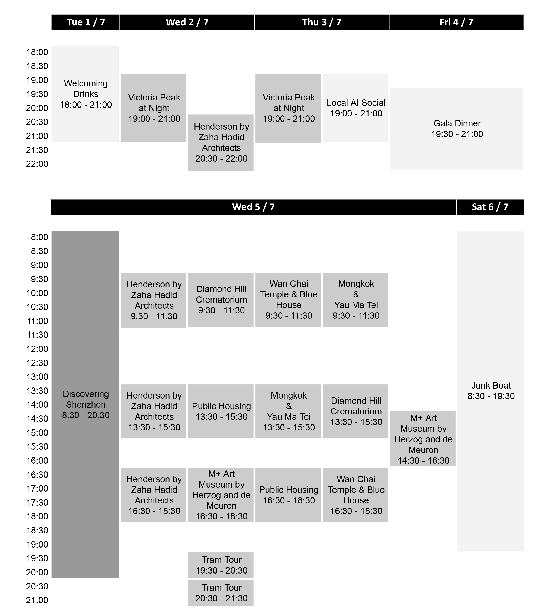

<div class="thumbnail-wrapper">

<div class="thumbnail-grid">

<div class="thumbnail-card">
  <a href="event_details.html#Henderson">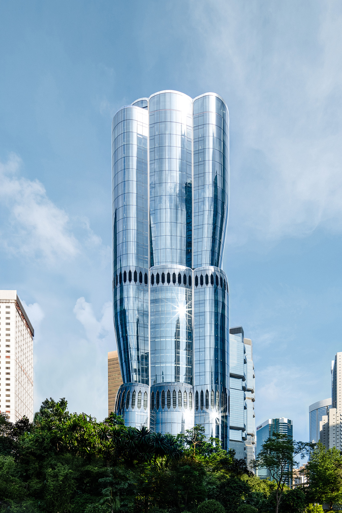</a>
  <div class="caption">
    <h3>Henderson by Zaha Hadid Architects</h3>
    <p class="event-category"><br>Architecture Tour</p>
    <p class="writeup">The Henderson by Zaha Hadid Architects: Vertical Fluidity and Urban Innovation</p>
  </div>
</div>

<div class="thumbnail-card">
  <a href="event_details.html#MPlus">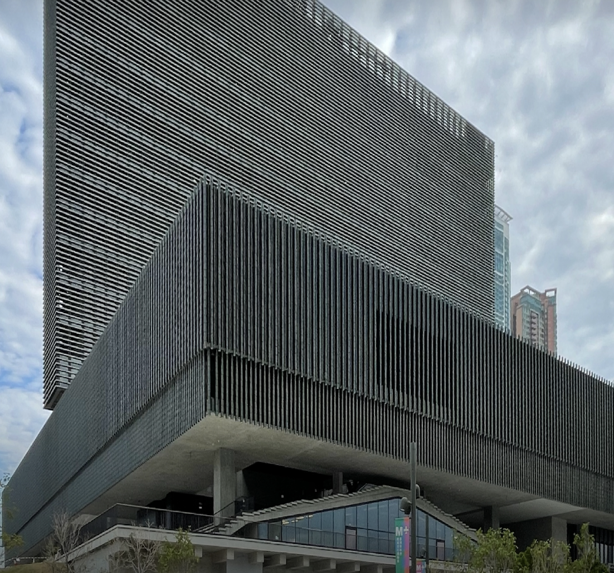</a>
  <div class="caption">
    <h3>M+ Art Museum by Herzog and de Meuron</h3>
    <p class="event-category"><br>Architecture Tour</p>
    <p class="writeup">Inside the Making of a Cultural Landmark</p>
  </div>
</div>

<div class="thumbnail-card">
  <a href="event_details.html#ShenzhenTour">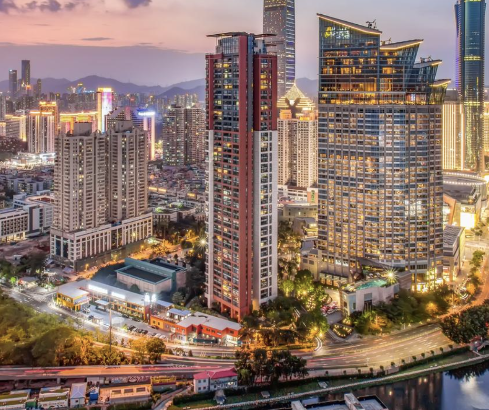</a>
  <div class="caption">
    <h3>Discovering Shenzhen</h3>
    <p class="event-category"><br>Field Trip</p>
    <p class="writeup">Exploring Innovation and Urban Transformation in China’s Design Capital.</p>
  </div>
</div>


<div class="thumbnail-card">
  <a href="event_details.html#TramTourWestToEast">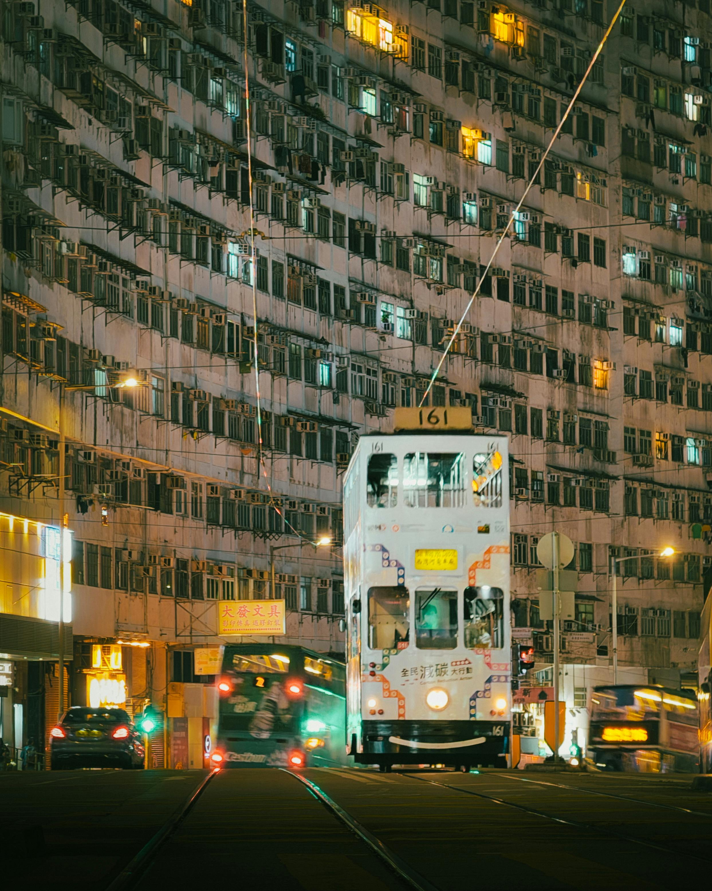</a>
  <div class="caption">
    <h3>North Point to Whitty Street Tram Depot</h3>
    <p class="event-category"><br>Tram Tour</p>
    <p class="writeup">A Moving Lens on Hong Kong’s Vertical Urbanism.</p>
  </div>
</div>

<div class="thumbnail-card">
  <a href="event_details.html#PublicHousing">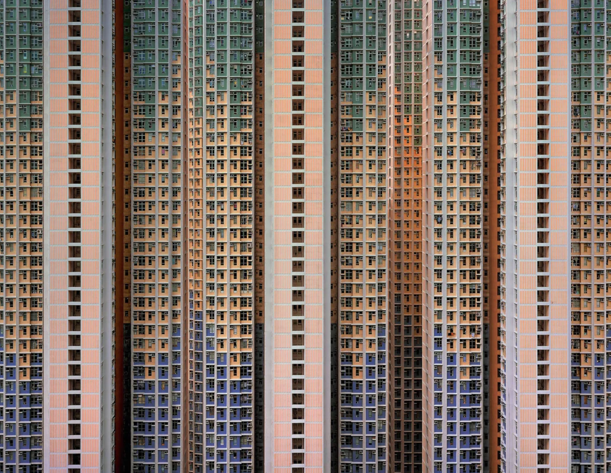</a>
  <div class="caption">
    <h3>Public Housing</h3>
    <p class="event-category"><br>Architecture Tour</p>
    <p class="writeup">Understanding Urban Density through Repetition and Design</p>
  </div>
</div>


<div class="thumbnail-card">
  <a href="event_details.html#DiamondHill">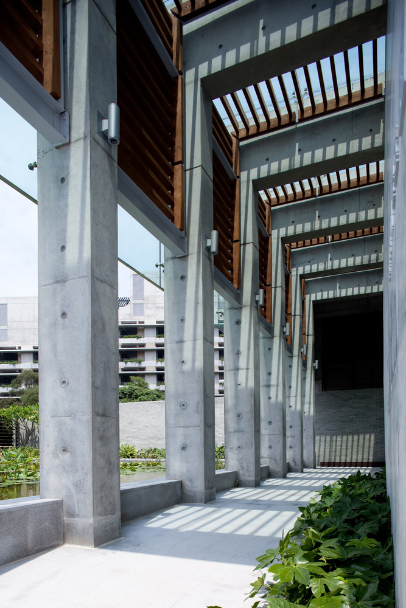</a>
  <div class="caption">
    <h3>Diamond Hill Crematorium</h3>
    <p class="event-category"><br>Architecture Tour</p>
    <p class="writeup">A panoramic evening escape above the city.</p>
  </div>
</div>

<div class="thumbnail-card">
  <a href="event_details.html#MongkokYauMaTei">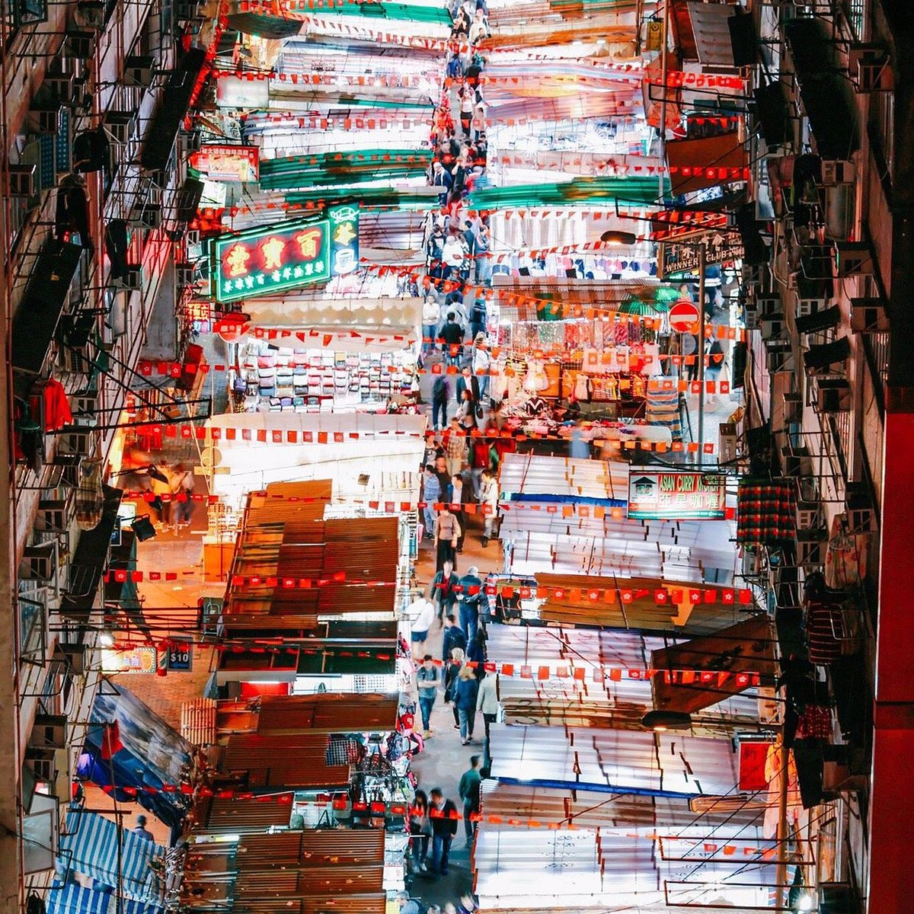</a>
  <div class="caption">
    <h3>Mongkok & Yau Ma Tei</h3>
    <p class="event-category"><br>Architecture Tour</p>
    <p class="writeup">Exploring Everyday Density and Urban Heritage</p>
  </div>
</div>

<div class="thumbnail-card">
  <a href="event_details.html#WanChaiTempleBlueHouse"></a>
  <div class="caption">
    <h3>Wan Chai Temple & Blue House</h3>
    <p class="event-category"><br>Architecture Tour</p>
    <p class="writeup">Exploring Spiritual Heritage and Urban Regeneration</p>
  </div>
</div>


<div class="thumbnail-card">
  <a href="event_details.html#VictoriaPeak">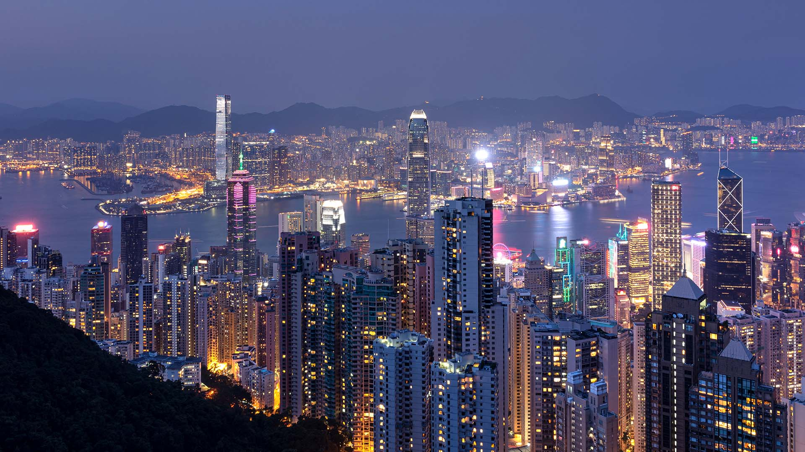</a>
  <div class="caption">
    <h3>The Victoria Peak and Night</h3>
    <p class="event-category"><br>Walking Tour</p>
    <p class="writeup">A panoramic evening escape above the city.</p>
  </div>
</div>


</div>

<div class="divider"></div>


<div class="thumbnail-grid">

<div class="thumbnail-card">
  <a href="event_details.html#GalaDinner">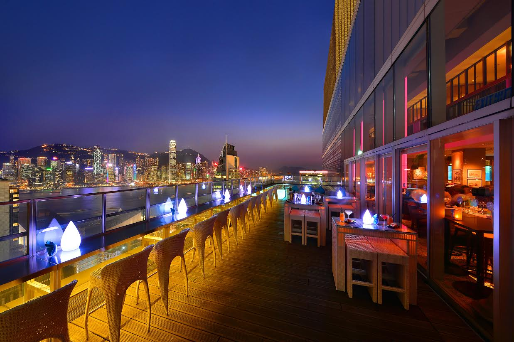</a>
  <div class="caption">
    <h3>Gala Dinner</h3>
    <p class="event-category"><br>Evening Social</p>
    <p class="writeup">Banquet – Maxim’s Palace (Get One More Ticket)</p>
  </div>
</div>


<div class="thumbnail-card">
  <a href="event_details.html#JunkBoatSaiKung">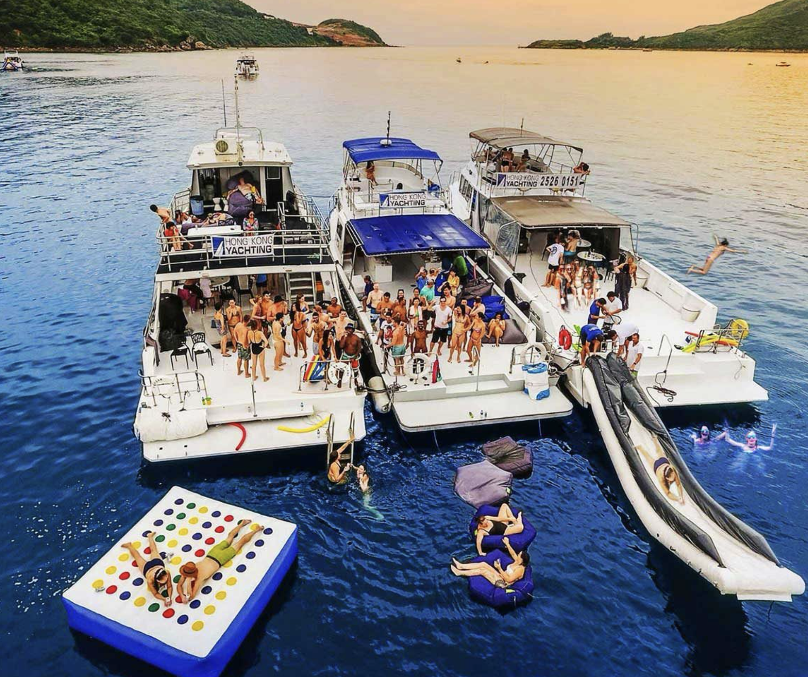</a>
  <div class="caption">
    <h3>Junk Boat Trip in Sai Kung</h3>
    <p class="event-category"><br>Social Event</p>
    <p class="writeup">A Scenic Escape to Hong Kong’s Exotic Back Garden.</p>
  </div>
</div>

<div class="thumbnail-card">
  <a href="event_details.html#BarCentral">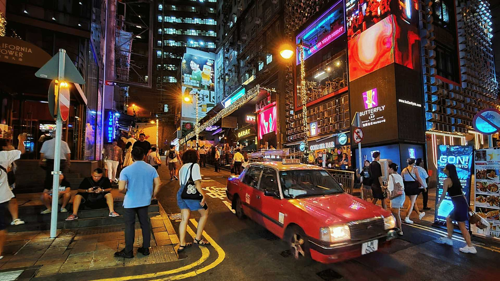</a>
  <div class="caption">
    <h3>Bar in Local AI Social</h3>
    <p class="event-category"><br>Evening Social</p>
    <p class="writeup">Join fellow participants for a laid-back night out in Central.</p>
  </div>
</div>

<div style="display:none">
<div class="thumbnail-card">
  <a href="event_details.html#BarTST">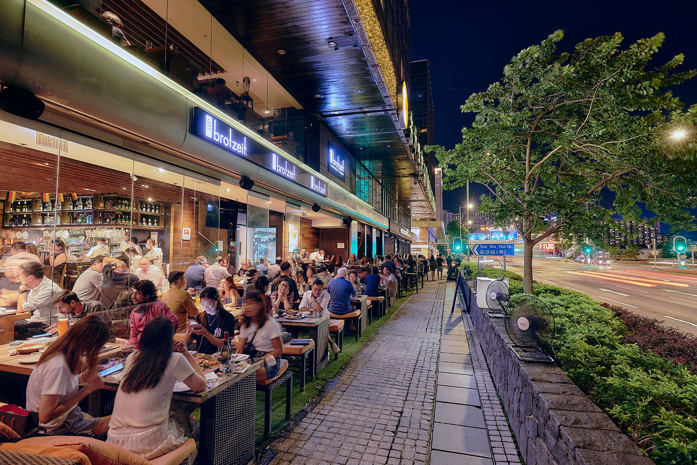</a>
  <div class="caption">
    <h3>Bar in Tsim Sha Tsui</h3>
    <p class="event-category"><br>Evening Social</p>
    <p class="writeup">Join fellow participants for a laid-back night out in Central.</p>
  </div>
</div>

</div>
</div>
```