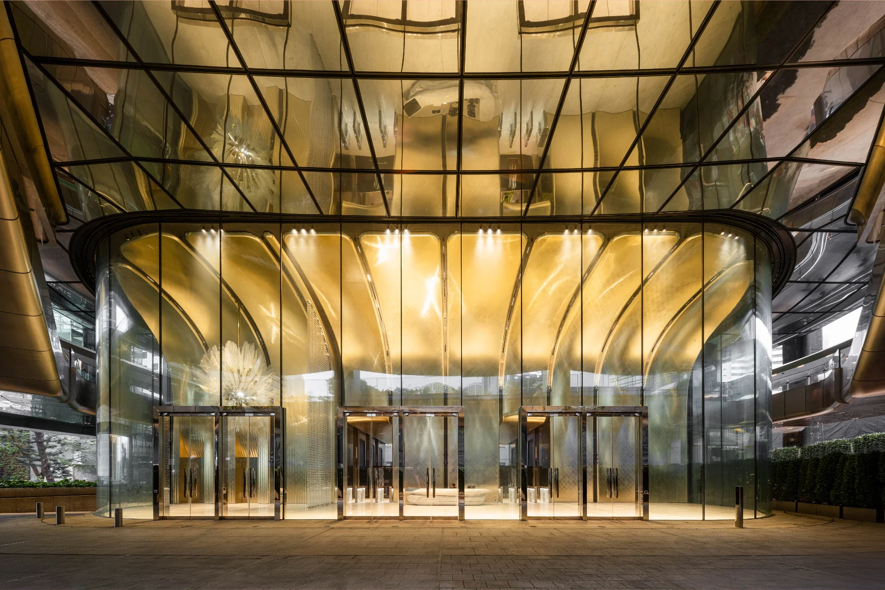

<!-- Keynote Sessions will feature presentations by two distinguished keynote speakers and three outstanding early-career women researchers. They will share innovative insights across the conference days, July 2–4, 2025.  -->

```{=html}
<style>
.table-container {
    display: flex;
    flex-direction: row;
    align-items: center;
    margin-bottom: 20px;
    padding: 25px;
    border: 0.25px dotted #aaa;
    border-radius: 10px;
    flex-wrap: wrap;
}

.image-cell {
    flex: 0 0 330px;
    display: flex;
    justify-content: center;  /* Horizontally center image */
    align-items: center;      /* Vertically center image */
    padding: 20px;            /* Equal padding on all sides */
    box-sizing: border-box;
}


.image-cell img {
    width: 100%;
    height: 280px;
    object-fit: cover;
    object-position: center center; /* 👈 forces center cropping */
    border-radius: 50%;
    display: block;
    margin: 0 auto;
}


.text-cell {
    flex: 1;
    min-width: 280px;
}

.text-cell h3 {
    margin: 0;
    font-size: 1.2em;
    font-weight: bold;
}

.text-cell p {
    margin: 10px 0;
    font-size: 1.1em;
    line-height: 1.6;
}


/* MEDIA QUERY for mobile or narrow screens */


@media (max-width: 768px) {
    .table-container {
        flex-direction: column;
        padding: 15px;
    }

    .image-cell {
        padding-right: 0;
        max-width: 120px;
        margin-bottom: 15px;
    }

    .text-cell {
        min-width: 100%;
    }
}

.ticket-button {
    display: inline-block;
    background-color: #ff0000;      /* Bright red */
    color: #fff;
    font-weight: bold;
    text-decoration: none;
    padding: 1px 1px;
    border-radius: 1.5px;
    margin-top: 15px;
    float: right;                  /* Align to the right */
    font-size: 1em;
    box-shadow: 0 2px 5px rgba(0, 0, 0, 0.15);
    transition: background 0.3s ease;
}

.ticket-button:hover {
    background-color: #cc0000;      /* Slightly darker on hover */
}
.event-category {
    font-weight: bold;
    font-size: 1.0em;
    color: #333;
    margin: 0;              /* <-- removes spacing above/below */
    padding: 2;
    line-height: 1.8;       /* tighter line-height for snug layout */
}

.event-heading {
    font-size: 1.5em;
    font-weight: 600;
    margin: 0;              /* or: margin-top: 2px; margin-bottom: 0; */
}


</style>

```

```{=html}
<div class="table-container">
    <div class="image-cell">
        <a href="events/DiamondHillCrematorium.html">
            
        </a>
    </div>
    <div class="text-cell">
        <div class="event-title-block">
            <div class="event-category">Walking Tour</div>
            <h1 class="event-heading">
                <span class="highlight">High Density Urbanism:</span>
                The Victoria Peak and Night
            </h1>
        </div>
        <p class="event-subtitle"><strong>A panoramic evening escape above the city.</strong></p>
        <p>Join us for a scenic evening walk from HKU to the Peak, offering panoramic views of Hong Kong's skyline illuminated at night.</p>
        <p>
            <strong>Date:</strong> 2nd July, 3rd July<br>
            <strong>Time:</strong><br>7:30PM – 10:30PM<br>
            <strong>Cost:</strong> Free
        </p>
        <a class="ticket-button" href="https://signup.example.com" target="_blank">Ticket Purchase</a>
    </div>
</div>
```

```{=html}
<div class="table-container">
    <div class="image-cell">
        <a href="events/BarCentral.html">
            
        </a>
    </div>
    <div class="text-cell">
        <div class="event-title-block">
            <div class="event-category">Evening Social</div>
            <h1 class="event-heading">
                <span class="highlight"></span>
                Bar in Central
            </h1>
        </div>
        <p class="event-subtitle"><strong>A panoramic evening escape above the city.</strong></p>
        <p><strong>Relax, connect, and toast to design in the heart of Hong Kong.</strong><br>
        Join fellow participants for a laid-back night out in Central. Enjoy great drinks, better conversations, and a taste of Hong Kong’s buzzing bar scene.<br><br>
        <strong>Date:</strong> 2nd July<br>
        <strong>Time:</strong><br>7:30PM – 10:30PM</p>
        <a class="ticket-button" href="https://hkuems1.hku.hk/hkuems/ec_hdetail.aspx?guest=Y&ueid=100479" target="_blank">Ticket Purchase</a>
    </div>
</div>
```

```{=html}
<div class="table-container">
    <div class="image-cell">
        <a href="events/GalaDinner.html">
            
        </a>
    </div>
    <div class="text-cell">
        <div class="event-title-block">
            <div class="event-category">Evening Social</div>
            <h1 class="event-heading">
                <span class="highlight"></span>
                Gala Dinner
            </h1>
        </div>
        <p class="event-subtitle"><strong>Banquet – Maxim’s Palace (Optional +1 Ticket)</strong></p>
        <!-- <p><strong>Banquet – Maxim’s Palace (Optional +1 Ticket)</strong><br> -->
        Join us for the official CAAD Futures 2025 Conference Banquet at the iconic Maxim’s Palace, a treasured Hong Kong venue known for its grand interiors and harbor views.<br><br>
        <strong>Time:</strong> 6:00PM – 10:30PM<br>
        <strong>Quota:</strong> 250<br>
        <strong>Cost:</strong> HKD 960</p>
        <a class="ticket-button" href="https://signup.example.com" target="_blank">Ticket Purchase</a>
    </div>
</div>
```
<!-- 
```{=html}
<div class="table-container">
    <div class="image-cell">
        <a href="events/GalaDinner.html">
            
        </a>
    </div>
    <div class="text-cell">
        <h3><a href="events/GalaDinner.html">Gala dinner (extra tickets)</a></h3>
        <p><strong>Banquet – Maxim’s Palace (Optional +1 Ticket)</strong><br>
        Join us for the official CAAD Futures 2025 Conference Banquet at the iconic Maxim’s Palace, a treasured Hong Kong venue known for its grand interiors and harbor views.<br><br>
        <strong>Time:</strong> 6:00PM – 10:30PM<br>
        <strong>Quota:</strong> 250<br>
        <strong>Cost:</strong> HKD 960</p>
    </div>
</div>
``` -->


```{=html}
<div class="table-container">
    <div class="image-cell">
        <a href="events/BarTST.html">
            
        </a>
    </div>
    <div class="text-cell">
        <div class="event-title-block">
            <div class="event-category">Evening Social</div>
            <h1 class="event-heading">
                <span class="highlight"></span>
                Bar in Tsim Sha Tsui
            </h1>
        </div>
        <p class="event-subtitle"><strong>Skyline views, harbour breeze, and vibrant conversations.</strong></p>
        
        Wind down after the conference with a relaxed night out in Wan Chai. Explore a curated mix of iconic bars, blending old Hong Kong charm with modern flair—perfect for casual networking and lively conversations.<br><br>
        <strong>Date:</strong> 3rd July<br>
        <strong>Time:</strong><br>7:30PM – 10:30PM</p>
        <a class="ticket-button" href="https://hkuems1.hku.hk/hkuems/ec_hdetail.aspx?guest=Y&ueid=100397" target="_blank">Ticket Purchase</a>
    </div>
</div>
```

```{=html}
<div class="table-container">
    <div class="image-cell">
        <a href="events/DiamondHillCrematorium.html">
            
        </a>
    </div>
    <div class="text-cell">
        <div class="event-title-block">
            <div class="event-category">Architecture Tour</div>
            <h1 class="event-heading">
                <span class="highlight">Unique Typologies:</span>
                Diamond Hill Crematorium
            </h1>
        </div>
        <p class="event-subtitle"><strong>A panoramic evening escape above the city.</strong></p>
        <p>Join us for a scenic evening walk from HKU to the Peak, offering panoramic views of Hong Kong's skyline illuminated at night.</p>
        <p>
            <strong>Date:</strong> 2nd July, 3rd July<br>
            <strong>Time:</strong><br>7:30PM – 10:30PM<br>
            <strong>Cost:</strong> Free
        </p>
        <a class="ticket-button" href="https://signup.example.com" target="_blank">Ticket Purchase</a>
    </div>
</div>
```
<!-- 
```{=html}
<div class="table-container">
    <div class="image-cell">
        <a href="events/WanChaiTempleBlueHouse.html">
            
        </a>
    </div>
    <div class="text-cell">
        <div class="event-title-block">
            <div class="event-category">Architecture Tour</div>
            <h1 class="event-heading">
                <span class="highlight">Unique Typologies:</span>
                Wan Chai Temple & Blue House
            </h1>
        </div>
        <p class="event-subtitle"><strong>Exploring Spiritual Heritage and Urban Regeneration</strong></p>
        Explore one of Hong Kong’s oldest districts through its temples, tenement buildings, and revitalized heritage sites.<br><br>
        <strong>Date:</strong> 5th July<br>
        <strong>Time:</strong><br> 9:30AM – 11:30AM<br>4:30PM – 6:30PM<br>
        <strong>Quota:</strong> 30<br>
        <strong>Cost:</strong> HKD 250</p>
        <a class="ticket-button" href="https://signup.example.com" target="_blank">Ticket Purchase</a>
    </div>
</div>
``` -->
<!-- ```{=html}

<div class="table-container">
    <div class="image-cell">
        <a href="events/PublicHousing.html">
            
        </a>
    </div>
    <div class="text-cell">
        <h3><a href="events/PublicHousing.html">Architecture Tour - Public Housing</a></h3>
        <p><strong>Understanding Urban Density through Repetition and Design</strong><br>
        Join Professor Christian J. Lange for a deep dive into Hong Kong’s iconic housing estates.<br><br>
        <strong>Date:</strong> 5th July<br>
        <strong>Time:</strong><br> 9:30AM – 11:30AM<br>4:30PM – 6:30PM<br>
        <strong>Quota:</strong> 30<br>
        <strong>Cost:</strong> HKD 250</p>
    </div>
</div>
``` -->

```{=html}
<div class="table-container">
    <div class="image-cell">
        <a href="events/PublicHousing.html">
            
        </a>
    </div>
    <div class="text-cell">
        <div class="event-title-block">
            <div class="event-category">Architecture Tour</div>
            <h1 class="event-heading">
                <span class="highlight"></span>
                Public Housing
            </h1>
        </div>
        <p class="event-subtitle"><strong>Understanding Urban Density through Repetition and Design</strong></p>
        Join Professor Christian J. Lange for a deep dive into Hong Kong’s iconic housing estates.<br><br>
        <strong>Date:</strong> 5th July<br>
        <strong>Time:</strong><br> 9:30AM – 11:30AM<br>4:30PM – 6:30PM<br>
        <strong>Quota:</strong> 30<br>
        <strong>Cost:</strong> HKD 250</p>
        <a class="ticket-button" href="https://signup.example.com" target="_blank">Ticket Purchase</a>
    </div>
</div>
```

```{=html}
<div class="table-container">
    <div class="image-cell">
        <a href="events/MPlus.html">
            
        </a>
    </div>
    <div class="text-cell">
        <div class="event-title-block">
            <div class="event-category">Architecture Tour</div>
            <h1 class="event-heading">
                <span class="highlight"></span>
                M+ Art Museum by Herzog and de Meuron
            </h1>
        </div>
        <p class="event-subtitle"><strong>Inside the Making of a Cultural Landmark</strong></p>
        Join Prof. Human T.L. Wu for a behind-the-scenes look at this iconic Herzog & de Meuron project.<br><br>
        <strong>Date:</strong> 5th July<br>
        <strong>Time:</strong><br> 2:30PM – 4:30PM<br>4:30PM – 6:30PM<br>
        <strong>Quota:</strong> 30<br>
        <strong>Cost:</strong> HKD 250 (M+ Tickets is not included)</p>
        <a class="ticket-button" href="https://signup.example.com" target="_blank">Ticket Purchase</a>
    </div>
</div>
```


```{=html}
<div class="table-container">
    <div class="image-cell">
        <a href="events/WanChaiTempleBlueHouse.html">
            
        </a>
    </div>
    <div class="text-cell">
        <div class="event-title-block">
            <div class="event-category">Architecture Tour</div>
            <h1 class="event-heading">
                <span class="highlight">High Density Urbanism:</span>
                Wan Chai Temple & Blue House
            </h1>
        </div>
        <p class="event-subtitle"><strong>Exploring Spiritual Heritage and Urban Regeneration</strong></p>
        Explore one of Hong Kong’s oldest districts through its temples, tenement buildings, and revitalized heritage sites. This guided walk offers a rich look at how Wan Chai balances tradition, community life, and contemporary urban renewal.<br><br><strong>Date:</strong> 5th July<br><strong>Time:</strong><br> 9:30AM – 11:30AM<br>4:30PM – 6:30PM<br><strong>Quota:</strong> 30<br><strong>Cost:</strong> HKD 250</p>
        <a class="ticket-button" href="https://signup.example.com" target="_blank">Ticket Purchase</a>
    </div>
</div>
```

```{=html}
<div class="table-container">
    <div class="image-cell">
        <a href="events/WanChaiTempleBlueHouse.html">
            
        </a>
    </div>
    <div class="text-cell">
        <div class="event-title-block">
            <div class="event-category">Architecture Tour</div>
            <h1 class="event-heading">
                <span class="highlight">High Density Urbanism:</span>
                Mongkok & Yau Ma Tei
            </h1>
        </div>
        <p class="event-subtitle"><strong>Exploring Everyday Density and Urban Heritage</strong></p>
        Explore one of Hong Kong’s oldest districts through its temples, tenement buildings, and revitalized heritage sites. This guided walk offers a rich look at how Wan Chai balances tradition, community life, and contemporary urban renewal.<br><br><strong>Date:</strong> 5th July<br><strong>Time:</strong><br> 9:30AM – 11:30AM<br>4:30PM – 6:30PM<br><strong>Quota:</strong> 30<br><strong>Cost:</strong> HKD 250</p>
        <a class="ticket-button" href="https://signup.example.com" target="_blank">Ticket Purchase</a>
    </div>
</div>
```


```{=html}
<div class="table-container">
    <div class="image-cell">
        <a href="events/WanChaiTempleBlueHouse.html">
            
        </a>
    </div>
    <div class="text-cell">
        <div class="event-title-block">
            <div class="event-category">Field Trip</div>
            <h1 class="event-heading">
                <span class="highlight"></span>
                Discovering Shenzhen
            </h1>
        </div>
        <p class="event-subtitle"><strong>Exploring Innovation and Urban Transformation in China’s Design Capital.</strong></p>
        This full-day architecture tour to Shenzhen offers an immersive experience into the city’s cutting-edge design, cultural revitalization, and urban transformation.<br><br><strong>
        Date:</strong> 5th July<br><strong>
        Time:</strong><br> 
        7:30PM – 10:30PM<br><strong>
        Quota:</strong> 49<br><strong>
        Cost:</strong> HKD 900</p>
        <a class="ticket-button" href="https://hkuems1.hku.hk/hkuems/ec_hdetail.aspx?guest=Y&ueid=100400" target="_blank">Ticket Purchase</a>
    </div>
</div>
```
<!-- 
```{=html}
<div class="table-container">
    <div class="image-cell">
        <a href="events/TramTourWestToEast.html">
            
        </a>
    </div>
    <div class="text-cell">
        <h3><a href="events/TramTourWestToEast.html">Tram Tour - Whitty Street Tram Depot to North Point</a></h3>
        <p><strong>A Moving Portrait of Hong Kong’s Architecture</strong><br>
        Ride Hong Kong’s iconic tram for a guided journey across the city’s evolving skyline. From historic streets to soaring towers, discover how architecture captures the rhythms of urban life and change.<br><br><strong>
        Date:</strong> 5th July<br><strong>
        Time:</strong><br>7:30PM – 9:00PM<br>
        <strong>Quota:</strong> 30<br><strong>Cost:</strong> HKD 250</p>
    </div>
</div>
``` -->

```{=html}
<div class="table-container">
    <div class="image-cell">
        <a href="events/tramtourwitty.html">
            
        </a>
    </div>
    <div class="text-cell">
        <div class="event-title-block">
            <div class="event-category">Tram Tour</div>
            <h1 class="event-heading">
                <span class="highlight"></span>
                Whitty Street Tram Depot to North Point
            </h1>
        </div>
        <p class="event-subtitle"><strong>A Moving Portrait of Hong Kong’s Architecture.</strong></p>
        Ride Hong Kong’s iconic tram for a guided journey across the city’s evolving skyline. From historic streets to soaring towers, discover how architecture captures the rhythms of urban life and change.<br><br><strong>
        Date:</strong> 5th July<br><strong>
        Time:</strong><br> 
        7:30PM – 9:00PM<br><strong>
        Quota:</strong> 30<br><strong>
        Cost:</strong> HKD 250</p>
        <a class="ticket-button" href="https://signup.example.com" target="_blank">Ticket Purchase</a>
    </div>
</div>
```

```{=html}
<div class="table-container">
    <div class="image-cell">
        <a href="events/tramtourwitty.html">
            
        </a>
    </div>
    <div class="text-cell">
        <div class="event-title-block">
            <div class="event-category">Tram Tour</div>
            <h1 class="event-heading">
                <span class="highlight"></span>
                North Point to Whitty Street Tram Depot
            </h1>
        </div>
        <p class="event-subtitle"><strong>A Moving Lens on Hong Kong’s Vertical Urbanism.</strong></p>
        Hop aboard a classic Hong Kong tram for a guided ride through the city’s architectural evolution. This moving tour offers fresh perspectives on urban density, heritage, and transformation—from North Point’s residential towers to Central’s iconic skyline.
        <br><br><strong>
        Date:</strong> 5th July<br><strong>
        Time:</strong><br> 
        8:30PM – 9:00PM<br><strong>
        Quota:</strong> 30<br><strong>
        Cost:</strong> HKD 250</p>
        <a class="ticket-button" href="https://signup.example.com" target="_blank">Ticket Purchase</a>
    </div>
</div>
```

```{=html}
<div class="table-container">
    <div class="image-cell">
        <a href="events/junkboat.html">
            
        </a>
    </div>
    <div class="text-cell">
        <div class="event-title-block">
            <div class="event-category">Social Event</div>
            <h1 class="event-heading">
                <span class="highlight"></span>
                Junk Boat Trip in Sai Kung
            </h1>
        </div>
        <p class="event-subtitle"><strong>A Scenic Escape to Hong Kong’s Exotic Back Garden.</strong></p>
        Unwind and recharge after the conference with a relaxing junk boat excursion through the scenic waters of Sai Kung, often referred to as the "back garden of Hong Kong." 
        <br><br><strong>
        Date:</strong> 6th July<br><strong>
        Time:</strong><br> 
        9:00AM – 7:30PM<br><strong>
        Quota:</strong> 43<br><strong>
        Cost:</strong> HKD 960</p>
        <a class="ticket-button" href="https://hkuems1.hku.hk/hkuems/ec_hdetail.aspx?guest=Y&ueid=100393" target="_blank">Ticket Purchase</a>
    </div>
</div>
```
<!-- 
```{=html}
<div class="table-container">
    <div class="image-cell">
        <a href="events/JunkBoatSaiKung.html">
            
        </a>
    </div>
    <div class="text-cell">
        <h3><a href="events/JunkBoatSaiKung.html">Social Event - Junk Boat in Sai Kung</a></h3>
        <p><strong>A Scenic Escape to Hong Kong’s Back Garden</strong><br>Wrap up the conference with a breezy escape on a private junk boat through Sai Kung’s stunning coastline—Hong Kong’s beloved “back garden.”<br><br><strong>Date:</strong> 6th July<br><strong>Time:</strong><br> 9:00AM – 7:30PM<br><strong>Quota:</strong> 43<br><strong>Cost:</strong> HKD 960</p>
    </div>
</div>
``` -->

```{=html}
<div class="table-container">
    <div class="image-cell">
        <a href="events/HendersonZahaHadid.html">
            
        </a>
    </div>
    <div class="text-cell">
        <h3><a href="events/HendersonZahaHadid.html">Architecture Tour - Henderson by Zaha Hadid Architects (TBC)</a></h3>
        <p><strong>A bold new icon in Hong Kong’s skyline.</strong><br>Step inside Zaha Hadid Architects’ newest icon in Hong Kong. Discover the building’s bold geometry, advanced structure, and design innovations on this exclusive guided tour.<br><br><strong>Date:</strong> 2nd July<br><strong>Time:</strong><br>7:30PM – 10:30PM<br><strong>Quota:</strong> 60<br><strong>Cost:</strong> HKD 250</p>
        Registration Coming Soon!
    </div>
</div>
```
