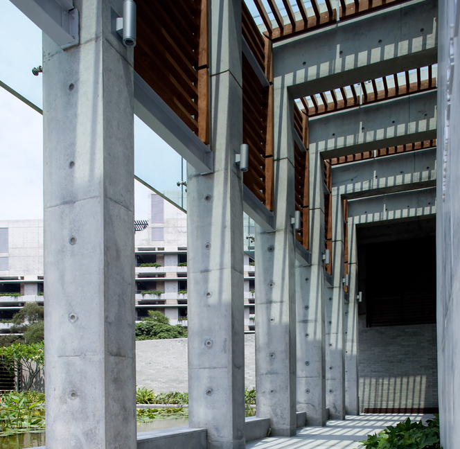
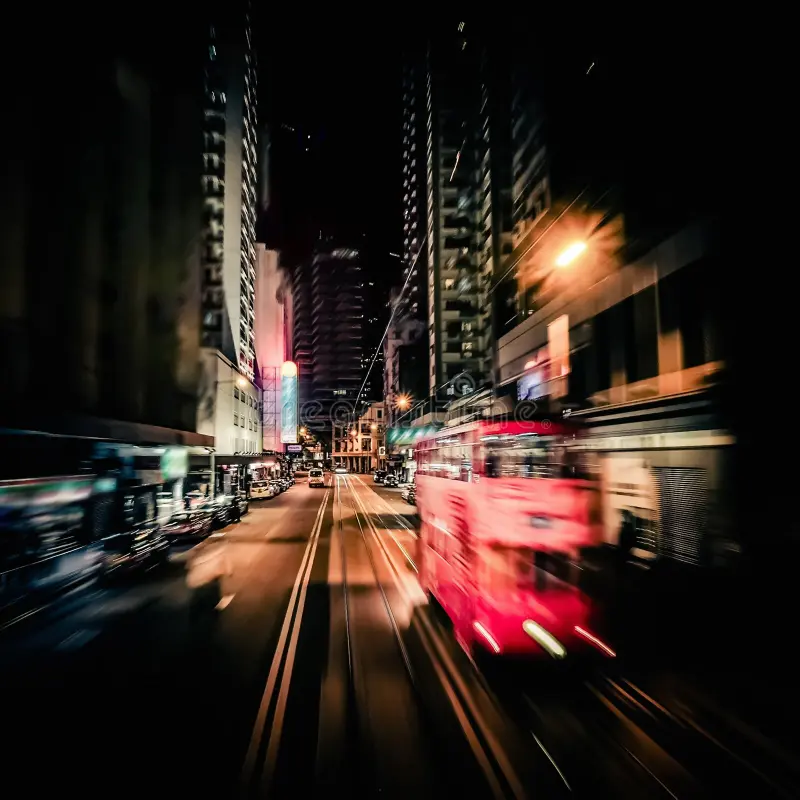

```{=html}

<style>
img.square-crop {
    width: 200px;              /* or any square size you want */
    height: 200px;
    object-fit: cover;         /* ensures it's cropped, not squashed */
    object-position: center;   /* centers the image focus */
    border-radius: 0;          /* no circle */
    display: block;
}

.ticket-button {
    display: inline-block;
    background-color: #ff0000;      /* Bright red */
    color: #fff;
    font-weight: bold;
    text-decoration: none;
    padding: 1px 1px;
    border-radius: 1.5px;
    margin-top: 15px;
    <!-- float: right;                  /* Align to the right */ -->
    font-size: 1em;
    box-shadow: 0 2px 5px rgba(0, 0, 0, 0.15);
    transition: background 0.3s ease;
}

.ticket-button:hover {
    background-color: #cc0000;      /* Slightly darker on hover */
}
</style>
```
<div id="VictoriaPeak"></div>

::: {layout-ncol=2}

{fig-alt="Walking Tour: Victoria Peak at Night" style="border-radius: 5%; width: 100%;"}

<div>

## Walking Tour: Victoria Peak at Night  
**High Density Urbanism**

A panoramic evening escape above the city.

Join us for a relaxed evening walk from HKU to The Peak, one of Hong Kong’s most iconic vantage points. As dusk falls, experience the city’s dazzling skyline come to life from above.

</div>

:::

**Highlights:**

- Gentle hike through green trails connecting the urban edge to nature.
- Spectacular night-time views of Victoria Harbour and the skyline.
- A chance to unwind, connect, and enjoy Hong Kong from a new perspective.
- Add details on length and elevation to manage expectations!!

**Event Details:**  
**Date:** 

- Option 1: Wednesday, 2nd July  [`Purchase this event`](https://hkuems1.hku.hk/hkuems/ec_hdetail.aspx?guest=Y&ueid=100398)
- Option 2: Thursday, 3rd July  [`Purchase this event`](https://hkuems1.hku.hk/hkuems/ec_hdetail.aspx?guest=Y&ueid=100481)
**Time:** 7:30PM – 10:30PM  
**Cost:** Free of charge

---

<div id="GalaDinner"></div>

::: {layout-ncol=2}

{fig-alt="Social Event: Gala Dinner (Extra Tickets)" style="border-radius: 5%; width: 100%;"}

<div>

## Social Event: Gala Dinner (Extra Tickets)  
**Banquet – Maxim’s Palace**

Join us for the official CAAD Futures 2025 Conference Banquet at the iconic Maxim’s Palace, a treasured Hong Kong venue known for its grand interiors and harbor views.

</div>

:::

**Highlights:**

- Lavish Cantonese banquet at one of Hong Kong’s most historic dining halls
- Networking opportunity in a relaxed, celebratory setting
- Reserved seating for registered guests and their +1 companions only

**Event Details:**  
**Time:** 6:00PM – 10:30PM  
**Quota:** 250  
**Cost:** HKD 960

**Notes:**  
> Banquet tickets are already included for all full conference registrants.  
> Additional tickets available for +1 guests only.  
> Name of registered participant required for +1 ticket.  
> No public sales or walk-ins accepted.

---

<div id="MPlus"></div>

::: {layout-ncol=2}

{fig-alt="Architecture Tour: M+ Art Museum" style="border-radius: 5%; width: 100%;"}

<div>

## Architecture Tour: M+ Art Museum by Herzog and de Meuron  
**Inside the Making of a Cultural Landmark**

Join HKU Adjunct Assistant Professor Human T.L. Wu for an in-depth architectural tour of the M+ Museum, a major work by Herzog & de Meuron and a defining icon in Hong Kong’s West Kowloon Cultural District.

</div>

:::

**Highlights:**

- Led by HKU Adjunct Assistant Professor Human Wu, who oversaw the M+ project during his time at Herzog & de Meuron.
- Behind-the-scenes insights into design development, materials, and construction.
- Examination of M+ as a cultural landmark, public space, and architectural statement.
- Discussion on the building’s response to local context, waterfront site, and urban visibility.

**Event Details:**  
**Date:** Saturday, 5th July  
**Time:** 

- Option 1: 2:30PM – 4:30PM [`Purchase this event`](https://hkuems1.hku.hk/hkuems/ec_hdetail.aspx?guest=Y&ueid=100384)
- Option 2: 4:30PM – 6:30PM [`Purchase this event`](https://hkuems1.hku.hk/hkuems/ec_hdetail.aspx?guest=Y&ueid=100420)
<!-- <a class="ticket-button" href="https://hkuems1.hku.hk/hkuems/ec_hdetail.aspx?guest=Y&ueid=100479" target="_blank">Purchase this event.</a> -->
 
**Quota:** 30  
**Cost:** HKD 250 (M+ Exhibition Entry Tickets is not included)

---

<div id="PublicHousing"></div>

::: {layout-ncol=2}

{fig-alt="Architecture Tour: Unique Typologies – High Density Public Housing" style="border-radius: 5%; width: 100%;"}

<div>

## Architecture Tour: Unique Typologies – High Density Public Housing  
**Understanding Urban Density through Repetition and Design**

Led by HKU Professor Christian J. Lange, co-author of *Cities of Repetition*, this guided architecture walk explores the evolution of Hong Kong’s large-scale residential developments.

</div>

:::

**Highlights:**

- Guided by HKU Professor Christian J. Lange, expert on Hong Kong’s housing typologies.
- Exploration of key public or private housing estates developed from the 1960s to early 2000s.
- In-depth discussion on urban density, standardization, and the aesthetics of repetition.
- A critical look at how these mass-produced environments shape urban identity and daily life.

**Event Details:**  
**Date:** Saturday, 5th July  
**Time:** 

- Option 1: 9:30AM – 11:30AM  [`Purchase this event`](https://hkuems1.hku.hk/hkuems/ec_hdetail.aspx?guest=Y&ueid=100389)
- Option 2: 4:30PM – 6:30PM  [`Purchase this event`](https://hkuems1.hku.hk/hkuems/ec_hdetail.aspx?guest=Y&ueid=100424)
**Quota:** 30  
**Cost:** HKD 250

---

<div id="DiamondHill"></div>

::: {layout-ncol=2}

{fig-alt="Architecture Tour: Unique Typologies – Diamond Hill Crematorium" style="border-radius: 5%; width: 100%;"}

<div>

## Architecture Tour: Unique Typologies – Diamond Hill Crematorium  
**Designing for Remembrance in a City of Density**

This exclusive architecture walk explores how public buildings in Hong Kong can respond to complex social and spatial challenges with dignity, clarity, and care.

</div>

:::

**Highlights:**

- Visit key spaces including the Columbarium, Courtyard, and Service Hall (subject to availability).
- Learn how architectural design facilitates respectful rituals in limited urban space.
- Understand the project’s spatial strategies, material use, and integration with the natural landscape.
- Gain insights into how public architecture can support both practical needs and emotional healing.

**Event Details:**  
**Date:** Saturday, 5th July  
**Time:** 

- Option 1: 9:30AM – 11:30AM  [`Purchase this event`](https://hkuems1.hku.hk/hkuems/ec_hdetail.aspx?guest=Y&ueid=100387)
- Option 2: 4:30PM – 6:30PM  [`Purchase this event`](https://hkuems1.hku.hk/hkuems/ec_hdetail.aspx?guest=Y&ueid=100422)
**Quota:** 30  
**Cost:** HKD 250

---

<div id="WanChaiTempleBlueHouse"></div>

::: {layout-ncol=2}

{fig-alt="Architecture Tour: High Density Urbanism – Wan Chai Temple & Blue House" style="border-radius: 5%; width: 100%;"}

<div>

## Architecture Tour: High Density Urbanism – Wan Chai Temple & Blue House  
**Exploring Spiritual Heritage and Urban Regeneration**

This guided walk takes participants through Wan Chai’s historical layers—visiting sacred sites and community heritage projects that reflect Hong Kong’s unique blend of tradition and modernity.

</div>

:::

**Highlights:**

- Explore Pak Tai Temple, a 19th-century Taoist temple rich in history and craftsmanship.
- Visit Hung Shing Temple, dedicated to the sea god and symbolic of Wan Chai’s coastal heritage.
- Tour the Blue House Cluster, a UNESCO-recognized revitalization project combining living heritage with social housing.
- Engage with themes of preservation, urban identity, and how historic architecture continues to shape daily life in Hong Kong.

**Event Details:**  
**Date:** Saturday, 5th July  
**Time:** 

- Option 1: 9:30AM – 11:30AM  [`Purchase this event`](https://hkuems1.hku.hk/hkuems/ec_hdetail.aspx?guest=Y&ueid=100391)
- Option 2: 4:30PM – 6:30PM  [`Purchase this event`](https://hkuems1.hku.hk/hkuems/ec_hdetail.aspx?guest=Y&ueid=100428)
**Quota:** 30  
**Cost:** HKD 250

---

<div id="MongkokYauMaTei"></div>

::: {layout-ncol=2}

{fig-alt="Architecture Tour: High Density Urbanism – Mong Kok & Yau Ma Tei" style="border-radius: 5%; width: 100%;"}

<div>

## Architecture Tour: High Density Urbanism – Mong Kok & Yau Ma Tei  
**Exploring Everyday Density and Urban Heritage**

This walking tour takes participants deep into the vibrant heart of Kowloon, where hyper-density, layered history, and eclectic architecture collide.

</div>

:::

**Highlights:**

- Navigate commercial streets like Sai Yeung Choi and Fa Yuen for a look at urban retail typologies.
- Visit Langham Place for insights on vertical mall design in a dense city.
- Explore cultural landmarks including Yau Ma Tei Theatre, Red Brick Building, and Tin Hau Temple.
- Examine the adaptive reuse and conservation of the Yau Ma Tei Fruit Market and Shanghai Street.
- Discuss the coexistence of traditional temples, colonial buildings, and modern towers in a compact urban grid.

**Event Details:**  
**Date:** Saturday, 5th July  
**Time:** 

- Option 1: 9:30AM – 11:30AM  [`Purchase this event`](https://hkuems1.hku.hk/hkuems/ec_hdetail.aspx?guest=Y&ueid=100392)
- Option 2: 4:30PM – 6:30PM  [`Purchase this event`](https://hkuems1.hku.hk/hkuems/ec_hdetail.aspx?guest=Y&ueid=100433)
**Quota:** 30  
**Cost:** HKD 250

---

<div id="ShenzhenTour"></div>

::: {layout-ncol=2}

{fig-alt="Field Trip: Discovering Shenzhen" style="border-radius: 5%; width: 100%;"}

<div>

## Field Trip: Discovering Shenzhen  
**Exploring Innovation and Urban Transformation in China’s Design Capital**

This full-day architecture tour to Shenzhen offers an immersive experience into the city’s cutting-edge design, cultural revitalization, and urban transformation.

</div>

:::

**Highlights:**

- Shenzhen Science & Technology Museum – Designed by Zaha Hadid Architects.
- Marisfrolg Headquarters – A striking example of corporate architecture.
- Nantou City Community Center – Designed by Prof. Chang Yung Ho.
- Cross-border dialogue on urbanism and density between Hong Kong and Shenzhen.
- Curated insights into spatial strategies, façade systems, and public engagement.
- Round-trip shuttle service provided from and back to HKU.

**Event Details:**  
**Date:** Saturday, 5th July  
**Time:** 7:30PM – 10:30PM  
**Quota:** 49  
**Cost:** HKD 900

**Notes:**  
> Important: Please ensure your passport and visa status allows entry into Mainland China.  
> Participants are responsible for meeting immigration requirements.

---

<div id="JunkBoatSaiKung"></div>

::: {layout-ncol=2}

{fig-alt="Social Event: Junk Boat in Sai Kung" style="border-radius: 5%; width: 100%;"}

<div>

## Social Event: Junk Boat in Sai Kung  
**A Scenic Escape to Hong Kong’s Back Garden**

Wrap up the conference with a breezy escape on a private junk boat through Sai Kung’s stunning coastline—Hong Kong’s beloved “back garden.”

</div>

:::

**Highlights:**

- All-day excursion through clear waters, forested islands, and geological formations.
- Great for casual networking and relaxation with fellow participants.
- Drinks and lunch included on board.
- Shuttle transport provided from HKU.

**Event Details:**  
**Date:** Sunday, 6th July  
**Time:** 9:00AM – 7:30PM  
**Quota:** 43  
**Cost:** HKD 960

---

<div id="TramTourWestToEast"></div>

::: {layout-ncol=2}

{fig-alt="Evening Tour: Tram Ride – Whitty Street Depot to North Point" style="border-radius: 5%; width: 100%;"}

<div>

## Evening Tour: Tram Ride – Whitty Street Depot to North Point  
**A Moving Portrait of Hong Kong’s Architecture**

Ride Hong Kong’s iconic tram for a guided journey across the city’s evolving skyline. From historic streets to soaring towers, discover how architecture captures the rhythms of urban life and change.

</div>

:::

**Highlights:**

- Ride on a classic open-top tram reserved for our group.
- Architectural narration as you pass through key districts.
- Experience Hong Kong’s architectural transition in real time.
- Photograph the city from a unique moving perspective.

**Event Details:**  
**Date:** Saturday, 5th July  
**Time:** 7:30PM – 8:30PM  [`Purchase this event`](https://hkuems1.hku.hk/hkuems/ec_hdetail.aspx?guest=Y&ueid=100403)
**Quota:** 30  
**Cost:** HKD 250

---

<div id="TramTourEastToWest"></div>

::: {layout-ncol=2}

{fig-alt="Evening Tour: Tram Ride – North Point to Whitty Street Depot" style="border-radius: 5%; width: 100%;"}

<div>

## Evening Tour: Tram Ride – North Point to Whitty Street Depot  
**A Moving Lens on Hong Kong’s Vertical Urbanism**

Hop aboard a classic Hong Kong tram for a guided ride through the city’s architectural evolution. This moving tour offers fresh perspectives on urban density, heritage, and transformation—from North Point’s residential towers to Central’s iconic skyline.

</div>

:::

**Highlights:**

- Ride through Hong Kong’s diverse architectural zones on a curated tram route.
- Guided narration by local architectural experts.
- Great views, thoughtful commentary, and casual social setting.
- Perfect conclusion to a day of conference activities.

**Event Details:**  
**Date:** Saturday, 5th July  
**Time:** 8:30PM – 9:30PM  [`Purchase this event`](https://hkuems1.hku.hk/hkuems/ec_hdetail.aspx?guest=Y&ueid=100435)
**Quota:** 30  
**Cost:** HKD 250

---

<div id="BarCentral"></div>

::: {layout-ncol=2}

{fig-alt="Evening Social: Bar in Central" style="border-radius: 5%; width: 100%;"}

<div>

## Evening Social: Bar in Central  
**Relax, connect, and toast to design in the heart of Hong Kong**

Join fellow participants for a laid-back night out in Central. Enjoy great drinks, better conversations, and a taste of Hong Kong’s buzzing bar scene.

</div>

:::

**Highlights:**

- Curated location offering great ambiance and design-forward vibe.
- Opportunity to network with peers in a relaxed social setting.
- Pay-as-you-go drinks; no registration fee.
- Easy access via public transport from conference venues.

**Event Details:**  
**Date:** Wednesday, 2nd July  
**Time:** 7:30PM – 10:30PM <a class="ticket-button" href="https://hkuems1.hku.hk/hkuems/ec_hdetail.aspx?guest=Y&ueid=100479" target="_blank">Purchase this event.</a>

---

<div id="BarTST"></div>

::: {layout-ncol=2}

{fig-alt="Evening Social: Bar in Tsim Sha Tsui" style="border-radius: 5%; width: 100%;"}

<div>

## Evening Social: Bar in Tsim Sha Tsui  
**Skyline views, harbour breeze, and vibrant conversations**

Wind down after the conference with a relaxed night out in Tsim Sha Tsui. Explore a curated mix of iconic bars, blending old Hong Kong charm with modern flair—perfect for casual networking and lively conversations.

</div>

:::

**Highlights:**

- Rooftop or waterfront venue with iconic skyline views.
- Unwind after a packed day of events with casual drinks and conversation.
- No registration fee—just show up and enjoy.
- Venue details announced closer to date.

**Event Details:**  
**Date:** Thursday, 3rd July  
**Time:** 7:30PM – 10:30PM

---
