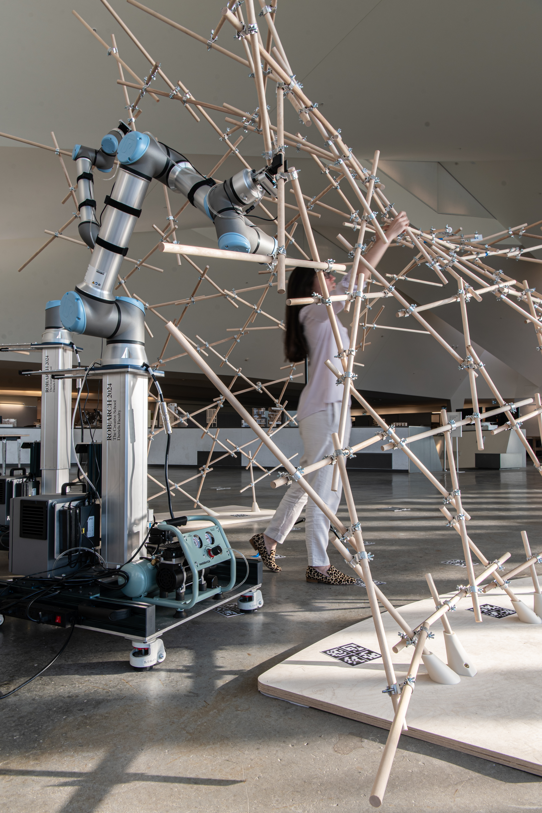

::: {layout-ncol=2}

{fig-alt="Prof. Daniela Mitterberger" style="border-radius: 50%; width: 80%;"}

## Prof. Dr. Daniela Mitterberger
##### Assistant Professor at Princeton School of Architecture
##### Director of XAIA Lab (Extended Augmentation in Architecture)
##### Architect, Partner and Co-Founder of MAEID (Büro für Architektur und transmediale Kunst)

 

:::

### About the Speaker

Daniela Mitterberger is an Austrian architect and researcher in digital fabrication and human machine interaction. Her research focuses on extended reality, spatial computing, and robotics. Mitterberger is an assistant professor at Princeton University where she leads the Extended Augmentation in Architecture Lab (XAIA). She serves on the Board of Directors of the COMPAS Association and is leading the development of COMPAS XR, the framework that integrates extended reality and robotics for architecture, engineering and construction.

Prior to joining Princeton University, Mitterberger was senior scientist and co-lead of the Immersive Design Lab at ETH Zurich. There she received her doctoral degree in Architecture in 2023, focusing on adaptive digital fabrication and human-machine collaboration.

Parallel to her academic career, Daniela Mitterberger also explores the boundaries between science and art with her multidisciplinary architecture office MAEID which she co-founded in 2015. MAEID’s work has been awarded numerous international prizes and exhibited in renowned galleries, institutions and events, including the Venice Biennale 2021, Seoul Biennale 2020, Ars Electronica Linz, and MAK Vienna.

### Lecture Abstract

This talk explores how emerging technologies—particularly spatial computing—are reshaping the way we interact with machines in design and construction. Moving beyond the limitations of 2D screens, tools like extended reality (XR), AI, and collaborative robotics allow digital information to be embedded directly into the physical world, opening up new forms of interaction between humans, machines, and materials. Starting from the idea that intuition can be augmented through computation, the talk reflects on how XR enables a shift from mass customization to mass collaboration in architecture. Through a series of built case studies, this talk will showcase ongoing research on immersive and interactive design, teleoperated fabrication, and human–machine collaboration. These projects show how digital tools can support and extend craft—enhancing precision and creativity while maintaining the tactile and cultural dimensions of making. The talk concludes with a broader reflection on the role of XR in AEC, and its potential to shape more collaborative, adaptive, and sustainable ways of working.

AR Timber Assembly 

AR Timber Assembly Closeup

Cocorporeality

Tieaknot