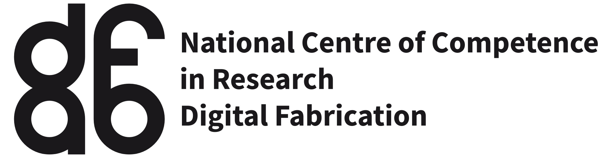

---
title: ''

format:
  html:
    toc: false
---





## CALL FOR PAPERS AND CATALYTIC INTERFACE PROPOSALS
<!-- ### <span style="color:red;"> FINAL SUBMISSION DEADLINE EXTENSION: 6 OCT (23:59 AOE)</span> -->

We are pleased to announce that CAAD Futures 2025 will be held at the University of Hong Kong during the first week of July 2025. 
 
The theme of CAAD Futures 2025 is ‘Catalytic Interfaces’. This reflects our goals (i) to catalyse collaborative and interdisciplinary research initiatives around emergent computer-aided architectural design (CAAD) research priorities, and (ii) to provide a platform for local, regional, and international researchers in the field of CAAD to interface and collaborate. 
 
To achieve this, we have designed a dynamic two-pronged programme. Our conference features [Regular Paper Presentations](regular.qmd) on emergent interfacing CAAD research. Additionally, a dedicated series of team-based [‘Catalytic Interfaces’](props.qmd) programming will provide infrastructure, both physical and digital, along with focused time and attention for fostering collaboration on new research priorities both during and prior to the conference.  

The paper submission and review process for CAAD Futures 2025 has concluded. Accepted papers will be presented at the conference. 
 
We very much look forward to welcoming you in Hong Kong. 
 
<p>Yours sincerely, <p>

<b>CAAD Futures 2025 Organising Committee</b>
 
{width=100px}
 
Prof. Kristof Crolla <br>
Prof. Kam-Ming Mark Tam <br>
Prof. Hongshan Guo <br>
Dr. Garvin Goepel <br>
Mr. Haotian Zhang <br>

Please send all inquiries to [this e-mail address](mailto:caadfutures2025@hku.hk). 

---
**Supported by**

```{=html}
<div style="text-align: center; margin: 30px 0;">
  <!-- Row 1: Bigger logos -->
  <div style="display: flex; justify-content: center; align-items: center; gap: 60px; height: 100px; margin-bottom: 30px;">
    
    
  </div>
  
  <!-- Row 2: Smaller logo -->
  <div style="display: flex; justify-content: center; align-items: center; height: 60px;">
    
  </div>
</div>
```