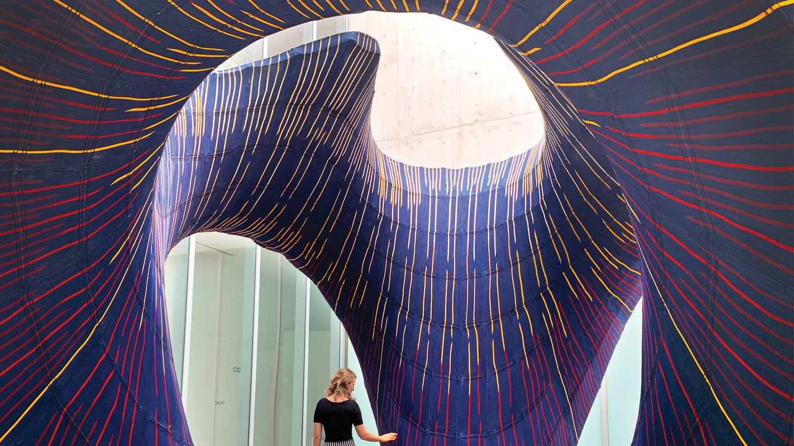
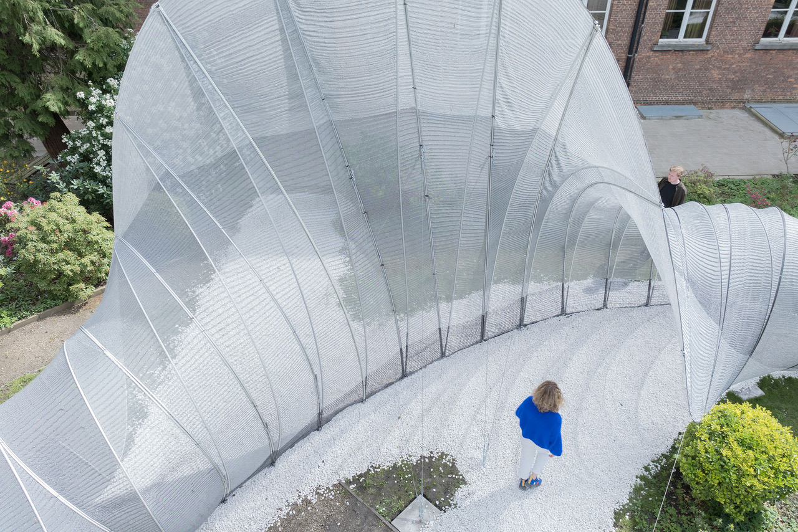
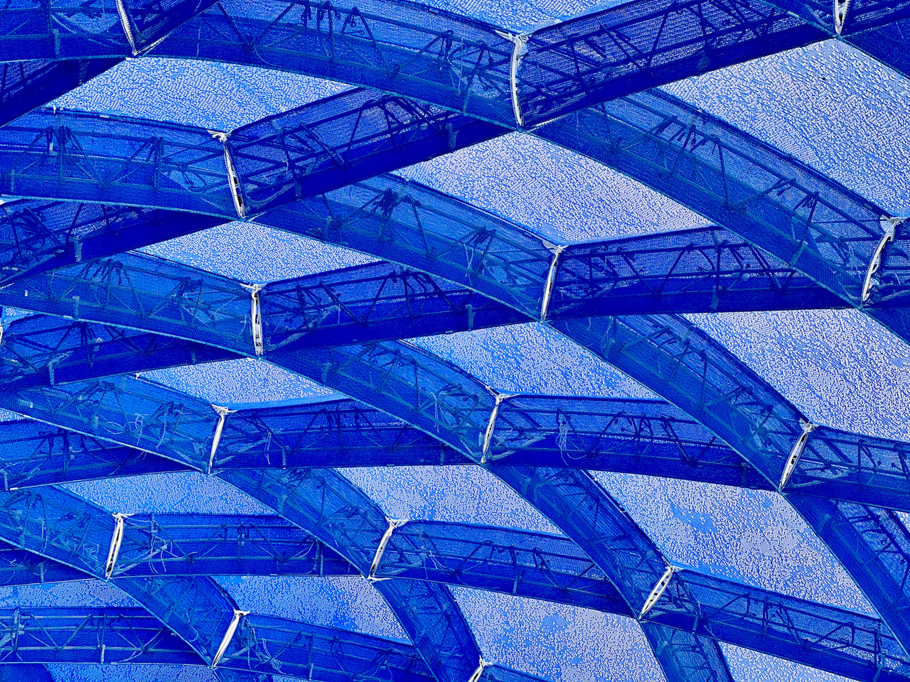

## Meet Asst. Prof. Dr. Mariana Popescu 

::: {layout-ncol=2}

{fig-alt="Prof. Mariana Popescu " style="border-radius: 50%; width: 80%;"}

#### Asst. Prof. Dr. Mariana Popescu 
#####  Assistant professor Digital fabrication, TU Delft

Dr. Mariana Popescu is Assistant Professor of Digital Fabrication at TU Delft  - Incoming MITwith a strong interest and experience in innovative ways of approaching the fabrication process and use of materials in construction. She obtained her PhD in 2019 from ETH Zurich and was named a “Pioneer” in the MIT Technology Review Innovator Under 35 list of 2019

:::

### Keynote Synopsis

Sustainable design, engineering, and fabrication strategies represent a critical challenge in today's building industry. As we shape the built environment, technological advances have expanded our capabilities to create complex geometries. However, the current climatic context demands that we shift from an "anything is possible" mindset to one mindful of performance, materials, and overall design elegance.

This presentation explores the relationship between design, material, and fabrication processes to enable the construction of innovative structures that rethink current construction systems. Through the lens of 3D knitting, it establishes a fabrication-aware design loop that highlights structural intelligence in design, the benefits of early-stage form-finding, the role of computational tools throughout the design process, and how digital fabrication enables more sustainable construction methods.

