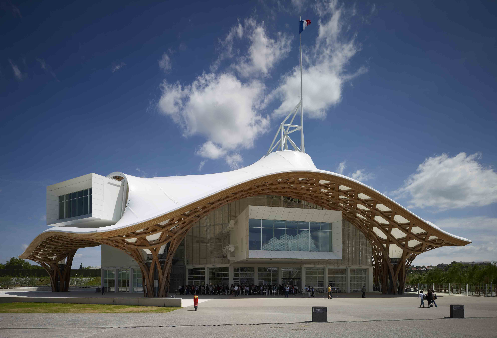
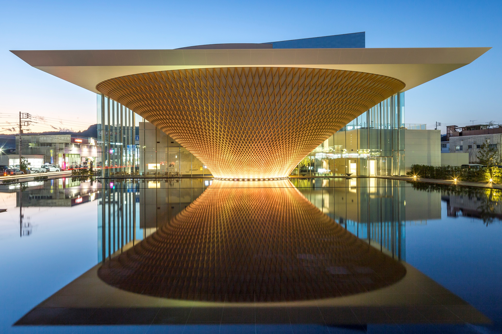
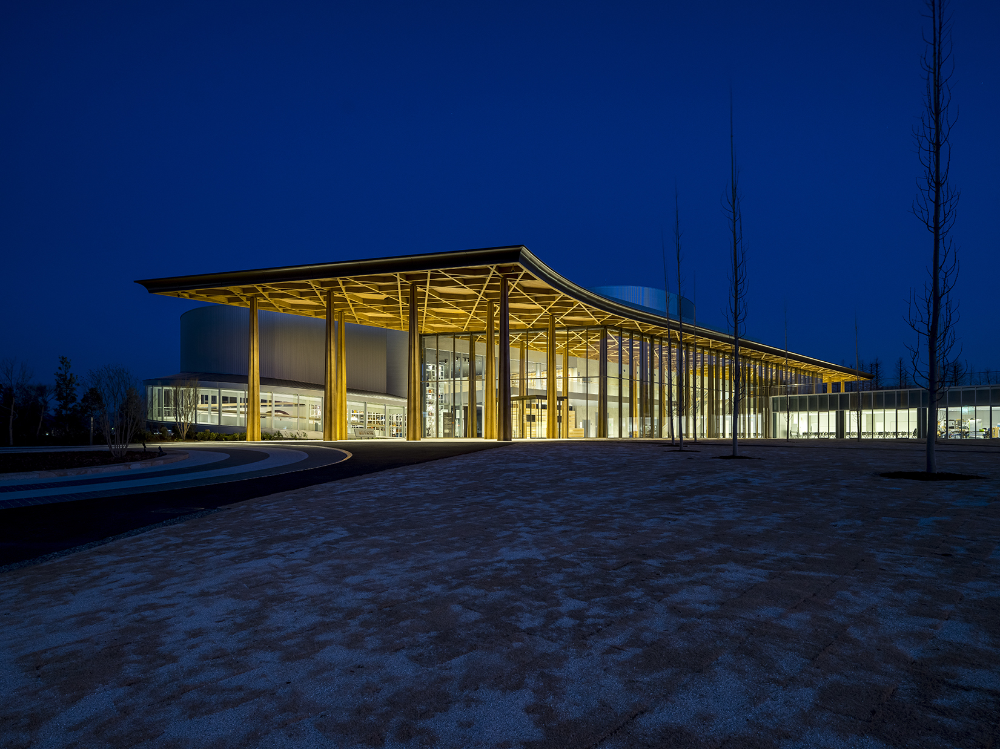

::: {layout-ncol=2}

{fig-alt="Prof. Shigeru Ban" style="border-radius: 50%; width: 80%;"}

## Prof. Shigeru Ban
##### Founder and Principal of Shigeru Ban Architects
##### Professor, Shibaura Institute of Techonology
##### 2014 Pritzker Architecture Prize recipient

:::

### About the Speaker

Shigeru Ban, a recipient of the Pritzker Architecture Prize, has created his innovative architectural works using unconventional materials such as paper over 40 years of his career as an architect. He has also worked relentlessly on the disaster relief efforts since 1995 up until now. In this lecture, Shigeru Ban refers to his past and the latest architectural works as well as his humanitarian activities, and explains on the  works and humanitarian activities.

Born in Tokyo in 1957, Ban graduated from the Cooper Union with a Bachelor of Architecture in 1984. He founded Shigeru Ban Architects in 1985 and later established offices in New York and Paris. Since 1985, Ban has developed a unique structural system using recycled paper as a building material and, alongside his architectural work, has been engaged in disaster relief efforts worldwide. In 1995, he founded a nonprofit organization named Voluntary Architects’ Network (VAN). He is the recipient of le grade de commandeur of L’Ordre des Arts et des Lettres, France (2014), the Pritzker Architecture Prize (2014), the Mother Teresa Social Justice Award (2017), the Princess of Asturias Award for Concord (2022), and the Praemium Imperiale for Architecture (2024). His major works include Centre Pompidou Metz (2010, France), Cardboard Cathedral (2013, NZ), La Seine Musicale (2017, France), Mt. Fuji World Heritage Centre Shizuoka (2017, France), Tainan Art Museum (2019), SIMOSE (2023), and Toyota City Museum (2024). Currently, he serves as Special Guest Professor at Shibaura Institute of Technology. In March 2023, he was named a new member of the Japan Art Academy.

### About the Talk

#### Talk Synopsis: Balancing Architectural Works and Social Contributions

Shigeru Ban’s Vision for Human-Centered Architecture In a world facing escalating environmental and humanitarian crises, how can architecture become a force for social good? Renowned architect and humanitarian Shigeru Ban, recipient of the Pritzker Architecture Prize, challenges conventional notions of design by prioritizing sustainability, flexibility, and human dignity. His approach goes beyond aesthetics, redefining architecture as a discipline that must actively contribute to solving global challenges. Ban has pioneered the use of recyclable materials such as paper tubes to create innovative structures, from world-class museums to emergency shelters in disaster-stricken regions. His work demonstrates that architecture can be both beautiful and responsible, addressing the needs of communities rather than serving only the privileged. He has consistently argued that architects have a social responsibility—not just to create striking designs, but to respond to the urgent needs of displaced populations, those affected by natural disasters, and societies struggling with rapid urbanization. Through case studies such as the Nomadic Museum, post-disaster housing projects, and nature-integrated designs, Ban illustrates how architecture can harmonize with the environment while responding dynamically to human crises. His projects prove that movable and recyclable architecture is not just an experimental concept but a practical solution for an ever-changing world. Looking ahead, he envisions a future where sustainable materials and innovative design principles redefine how we build, ensuring that architecture remains a discipline rooted in ethics, resilience, and sustainability.

**Event Details:**

- **Date:** July 2, 2025
- **Time:** 5:00 PM - 6:00 PM   [`Tickets`](https://hkuems1.hku.hk/hkuems/ec_hdetail.aspx?guest=Y&ueid=100760)
- **Venue:** Rayson Huang Theatre, The University of Hong Kong  
<!-- - **Capacity:** Limited Capacity -->

#### Ticket Information

**Special Event Tickets:** $300 (non-HKU) | $180 (HKU student/staff)

- Includes presentation and Q&A session 
- **Separate tickets made available for purchase by outside guests** who are not registered for the conference.
- **Conference registrants:** `Do not purchase a ticket` — this event is included with your registration!

Centre Pompidou-Metz, France, 2010

Mt.Fuji World Heritage Centre, Japan, 2017

Toyota City Museum, Japan, 2024