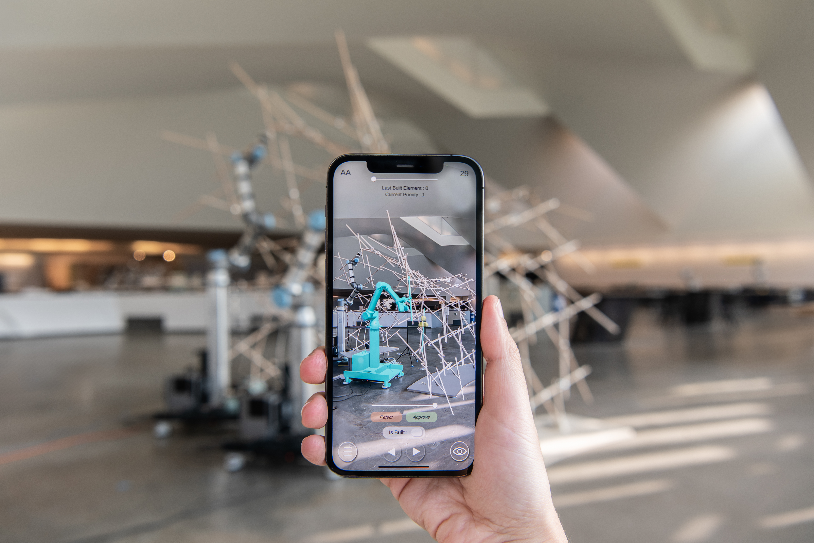
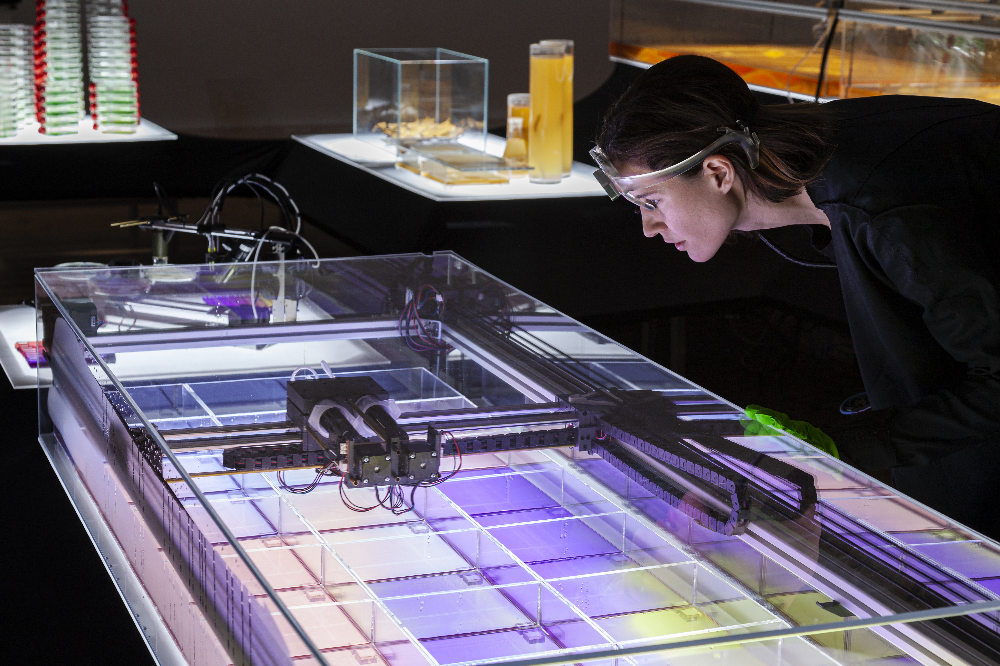
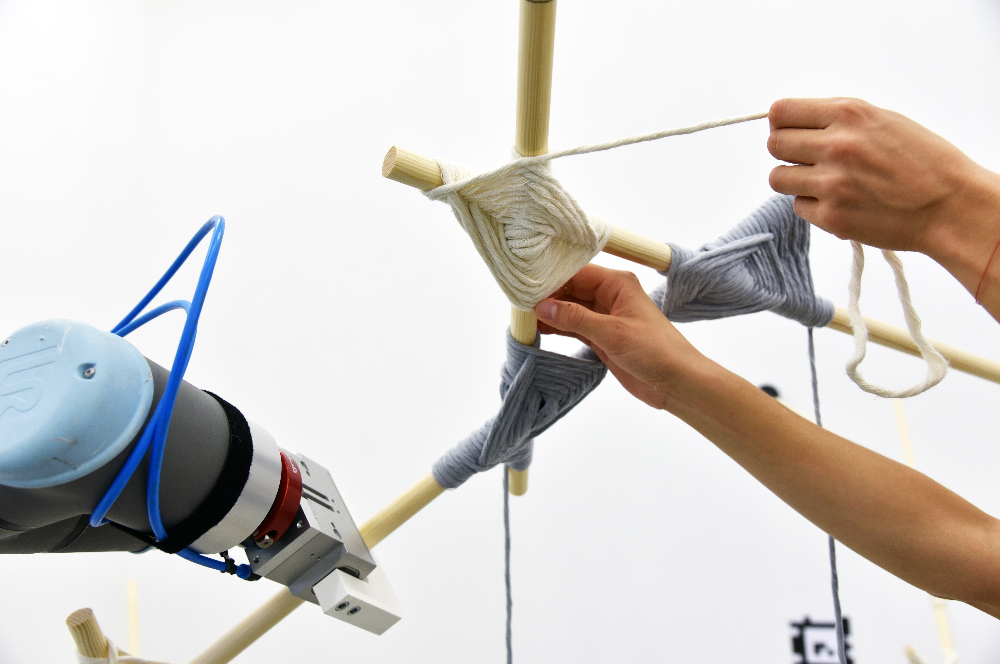

::: {layout-ncol=2}

{fig-alt="Dr. Wanyu He" style="border-radius: 50%; width: 80%;"}

## Dr. Wanyu He 
#####  Founder & CEO
#####  XKool Technology and LookX AI

:::

### About the Speaker

Wanyu He is a trailblazer in the fusion of architecture and artificial intelligence, serving as the Founder and CEO of XKool Technology and LookX AI. A visionary leader, she is revolutionizing the design and construction industries by leveraging cutting-edge AI technologies to enhance creativity, efficiency, and sustainability.

With over seven years of experience as a Senior Project Architect at OMA Rotterdam and Hong Kong, Wanyu has played a pivotal role in delivering iconic projects such as the Shenzhen Stock Exchange.

Wanyu is also a dedicated educator, currently serving as a Specially Appointed External Lecturer at Shenzhen University (2023–) and previously as an Adjunct Assistant Professor at the University of Hong Kong (2019–2020). Her teaching bridges the gap between academic theory and practical innovation, inspiring the next generation of architects.

Currently holding a doctoral degree from Florida International University and pursuing her Ph.D. at Tongji University and, Wanyu focuses on the integration of artificial intelligence in spatial architecture. This builds upon her Master of Science in Architectural Design and Computer Algorithms from the Berlage Institute at Delft University of Technology, showcasing her exceptional blend of technical and creative expertise.

Through her leadership, research, and teaching, Wanyu He is shaping the future of architecture, demonstrating how AI can amplify human ingenuity to create smarter, more sustainable built environments.

### Lecture Abstract

Artificial intelligence is no longer a distant promise but a transformative force reshaping the architecture and construction industries. At its core, AI challenges traditional design paradigms, enabling architects to rethink creativity, efficiency, and sustainability in the built environment. By leveraging generative algorithms and intelligent systems, AI empowers designers to explore unprecedented possibilities, from optimized 2D and 3D models to seamless integration with manufacturing and supply chains. Yet, this technological shift raises profound questions: How does AI redefine the role of the architect? What ethical considerations emerge as machines collaborate in the creative process? And how can human ingenuity coexist with intelligent systems to address the complexities of modern design? This discussion explores these themes through the lens of practical applications and real-world case studies, offering a critical perspective on the evolving relationship between architecture and AI—one that challenges us to envision a future where technology and creativity converge to redefine what is possible.

XKool Hero Images-1

XKool Hero Images-2

XKool Hero Images-3

XKool Hero Images-4